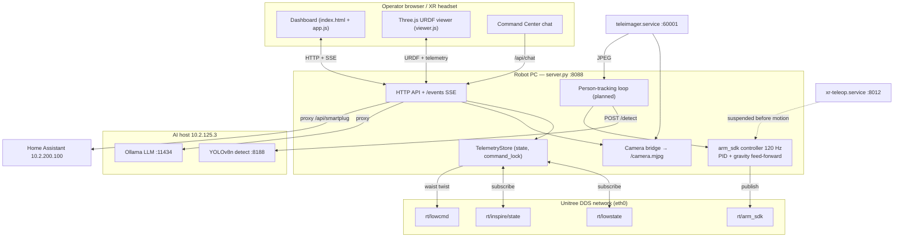

# 01 - Architecture

## Components

| Component | Where | Responsibility |
| --- | --- | --- |
| **`server.py`** | Robot PC (`/home/unitree/robot_telemetry_web`) | Python stdlib HTTP server + SSE, DDS subscribers, camera bridge, dashboard APIs, guarded command endpoints, closed-loop arm replay, chat/MCP proxy |
| **Static dashboard** | Served by `server.py` → browser | `index.html`, `app.js` (state/API/SSE/controls), `viewer.js` (Three.js URDF viewer), `styles.css`, `diagram.js` (.drawio viewer) |
| **DDS telemetry** | Robot DDS network (`eth0`, `192.168.123.164`) | `rt/lowstate`, `rt/inspire/state` subscribed; `rt/arm_sdk`, `rt/lowcmd`, `rt/inspire/cmd` command topics |
| **arm_sdk controller** | Inside `server.py` | 120 Hz closed-loop arm/waist pose controller (PID + gravity feed-forward) publishing to `rt/arm_sdk` — used by Home hold and arm replay; see [[03 - Safety Interlocks#arm_sdk joint set]] |
| **TeleImager** | `teleimager.service` on robot PC | WebRTC head-camera server (`:60001`); frames also reach `server.py` for the MJPEG bridge |
| **XR / Vuer teleop** | `xr-teleop.service` on robot PC | Vision Pro / WebXR teleoperation (`:8012`); can publish motion — suspended before dashboard motion (see [[03 - Safety Interlocks#XR publisher suspension]]) |
| **AI host** | `10.2.125.3` | On-prem **Ollama** LLM (`:11434`), optional STT (`:8001`) / TTS (`:8002`), and the **YOLOv8n** detection service (`:8188`) |
| **Home Assistant** | `10.2.200.100` | Showcase Sonoff smart plug, proxied via `/api/smartplug/*` |

See 02 - Network & Hosts for exact addresses and ports.

## System diagram

## Data flow

### Telemetry (read path)

1. Robot firmware publishes `rt/lowstate` (body) and `rt/inspire/state` (hands) on the DDS network.
2. `server.py` DDS subscribers store the latest messages in `TelemetryStore` (guarded by `command_lock`).
3. The store normalizes samples into a snapshot (`/api/state`).
4. `/events` streams the snapshot as **Server-Sent Events roughly every 100 ms**; the browser also polls specific `/api/*` endpoints.
5. `viewer.js` maps body motor telemetry → URDF joints and hand telemetry → RH56BFX finger joints for the 3D model.

### Command (write path)

1. Browser (or chat/MCP) POSTs a guarded command (e.g. `/api/robot/home`, `/api/wrist/command`, `/api/loco/command`).
2. `server.py` validates intent (`has_risk_ack`), suspends XR motion publishers, checks mutual exclusion via cancel-Events, and clamps to `JOINT_LIMITS` — see [[03 - Safety Interlocks]].
3. Arm/waist motion goes through the **arm_sdk controller**: a background thread interpolates, velocity-bounds, and runs a closed-loop PID + gravity feed-forward corrector publishing to `rt/arm_sdk` at 120 Hz.
4. High-level locomotion goes through the Unitree `LocoClient` (`/api/loco/command`), conceptually mapping to `rt/api/loco/request` / `rt/api/loco/response`.
5. Waist yaw (joint 12) is driven separately over `rt/lowcmd` commanding **only** joint 12 (arms stay on arm_sdk).

### Camera flow

- `teleimager.service` serves the WebRTC preview at `:60001`.
- `server.py` bridges frames to `/camera.mjpg` (MJPEG) for the dashboard panel.
- The planned tracking loop reads the freshest head-camera JPEG and forwards it to the AI-host YOLO service.

## The `TelemetryStore` object

`server.py`'s central `TelemetryStore` holds all mutable state behind a single
`command_lock` (`threading.Lock`):

- Latest `lowstate_msg` / hand state and derived snapshots.
- DDS publishers (`wrist_publisher` = arm_sdk publisher).
- Session state and cancel-Events: `wrist_cancel`, `replay_cancel` + `replay_thread`, `torso_cancel`.
- Command history / recording state.
- Chat tool dispatch (`run_chat_tool`, `chat_tool_specs`).

This is the coordination point for all the interlocks in [[03 - Safety Interlocks]].

## Related

[[03 - Safety Interlocks]]
