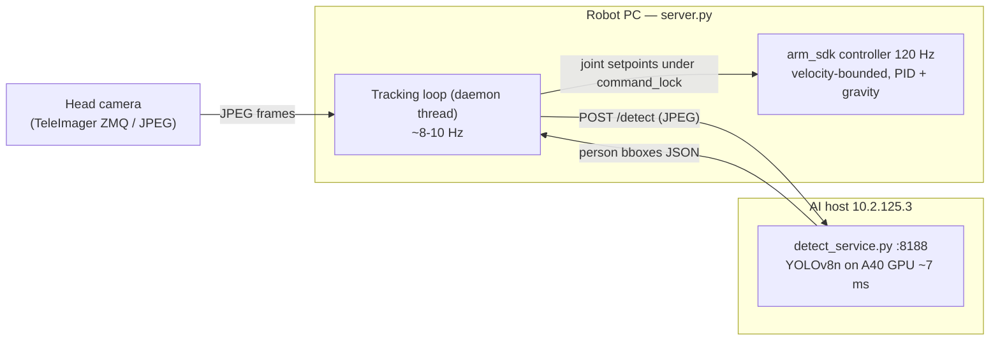
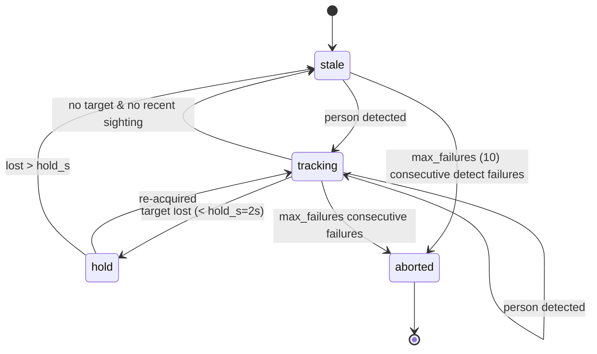

# 06 - Person Tracking (CV Feature)

> [!abstract] Goal
> The H1-2 continuously **points at the operator with its right arm**: a CV loop
> detects the person in the head-camera image and steers the right shoulder so
> the extended arm follows them — smoothly, and inside all existing
> [[03 - Safety Interlocks|safety interlocks]]. A showcase feature: it must look
> alive (smooth, responsive) and **fail safe** (arm returns to neutral whenever
> tracking degrades).

Sources: `docs/superpowers/specs/2026-07-21-person-pointing-design.md` (design)
and `docs/superpowers/plans/2026-07-21-person-pointing.md` (7-task plan), plus
`tracking.py` (implemented) and `deployment/ai_host/` (implemented).

**Out of scope for v1:** finger/hand gestures, waist rotation (joint 12 is
lowcmd-only), locomotion, multi-person choreography.

## Three-piece architecture



1. **Detection service** (exists) — `detect_service.py` on `10.2.125.3:8188`.
   POST a JPEG to `/detect` → normalized person boxes sorted by area. YOLOv8n,
   person class only, conf ≥ 0.4, ~7 ms/frame on an A40. See
   [[07 - Detection Service (YOLO)]].
2. **Tracking loop** (planned in `server.py`) — a daemon thread following the
   retargetable-controller pattern of `execute_lowcmd_pose`. At ~8 Hz it: reads
   the freshest head-camera JPEG, POSTs it to the detect service (timeout
   0.5 s), selects the target person, maps image coords → right-arm joint
   targets, smooths (EMA), and swaps setpoints into the arm controller under
   `command_lock` — exactly like `_pose_targets` retargeting.
3. **Control surface** (planned) — HTTP (`/api/track/*`), a dashboard card, and
   a chat/[[05 - Chat & MCP Tools|MCP]] `track_person` tool.

The **120 Hz arm controller does the hard part** (interpolation, velocity
bounding, PID + gravity feed-forward). The tracking loop only ever moves the
*setpoint*. Publishing at 8 Hz is fine because arm_sdk holds position between
commands.

## Image → joint mapping (no IK)

Pointing is a **2-DOF** problem, so no inverse kinematics. The right arm is held
in a fixed **pointing template** (elbow ~15° short of straight, wrist neutral);
only the shoulder aims it. Implemented in `tracking.py` `PointingMapper`.

| Aim axis | Input | Joint | Map |
| --- | --- | --- | --- |
| Horizontal | person `cx ∈ [0,1]` | 22 RightShoulderYaw | `yaw = yaw_offset + (cx − 0.5)·fov_yaw_rad` |
| Vertical | person `cy` (upper-third ≈ chest) | 20 RightShoulderPitch | `pitch = pitch_offset + (0.5 − cy)·fov_pitch_rad` |

- Fixed joints: `RightShoulderRoll (21)` and `RightElbow (23)` stay at template values.
- **Dead band** ±0.03 normalized units freezes the arm when the person barely moves (no jitter).
- All targets clamp to `TRACK_LIMITS` (tighter than `JOINT_LIMITS`); `server.py`
  re-clamps against `JOINT_LIMITS` again (defense in depth — see [[03 - Safety Interlocks]]).
- Setpoint changes are rate-limited to **≤ 0.35 rad/s** (`RateLimiter`), below controller caps.
- Smoothing: **EMA** with `alpha ≈ 0.35` (`Smoother`).

### `tracking.py` constants

```python
R_SHOULDER_PITCH = 20;  R_SHOULDER_ROLL = 21
R_SHOULDER_YAW   = 22;  R_ELBOW         = 23

POINTING_TEMPLATE = {20: 0.35, 21: -0.10, 22: 0.0, 23: 0.25}   # arm raised, aiming
NEUTRAL_TEMPLATE  = {20: 0.0,  21: -0.05, 22: 0.0, 23: 0.3}    # relaxed at side (stale/stop)
TRACK_LIMITS      = {20: (-0.6,1.2), 21: (-0.6,0.2), 22: (-1.0,1.0), 23: (0.1,1.2)}
```

`PointingMapper` defaults: `fov_yaw_rad=1.25`, `fov_pitch_rad=0.9`,
`yaw_offset=0.0`, `pitch_offset=0.35`, `dead_band=0.03`. These FOV constants are
env-tunable and get calibrated live on the robot (plan Task 7).

## Target selection policy (`associate`)

- On start (no previous target): lock onto the **largest** person box (nearest visitor).
- While locked: prefer the detection whose center is **nearest the previous
  target** (center-distance association) — so the robot doesn't jump between
  people when a second visitor walks through.
- Aim at the **upper-third midpoint** of the box (≈ chest height), not the box center.

## Staleness / failure state machine (`TrackState`)

Phases: `tracking` (fresh target) → `hold` (target briefly lost, keep pose) →
`stale` (lost too long, go neutral) → `aborted` (too many failures, end session).



- Defaults: `stale_after_s=1.5`, `hold_s=2.0`, `max_failures=10`.
- `on_detection` resets the failure count and picks a target via `associate`.
- `on_failure` increments failures; ≥ `max_failures` → `aborted` (terminal).
- **Fail-safe behaviors** (from the design, enforced by the loop):
  - Detection age > 1.5 s → ramp arm to `NEUTRAL_TEMPLATE` (velocity-bounded).
  - 10 consecutive detect-service failures → auto-stop (`aborted`), reason surfaced in status.
  - Session ceiling `TRACKING_MAX_SESSION_S` (600 s) → auto-stop.
  - DDS `rt/lowstate` older than 0.5 s → treat as stale, do not publish blindly.
  - `/api/track/stop`, chat `track_person stop`, or any replay/wrist/home start → cancel tracking first (shared cancel-Event; see [[03 - Safety Interlocks#Layer 4 — Cancel-Event mutual exclusion]]).

## Control surface (planned)

| Endpoint | Guard / behavior |
| --- | --- |
| `POST /api/track/start` | `has_risk_ack` (armed + i_understand_risk); `_suspend_xr_motion_publishers`; **409** if replay/wrist/home active; **503** if no DDS arm_sdk publisher |
| `POST /api/track/stop` | Always available; ramps to neutral, releases; idempotent (200) |
| `GET /api/track/status` | `{enabled, active, phase, target, detection_age_s, failures, message, updated_at}` |

- Dashboard **Person Tracking card** (Start/Stop, live phase, risk-ack checkboxes — mirrors the wrist card).
- Chat/MCP tool `track_person(action: start|stop, confirm: true)` behind
  `LLM_TOOL_TRACK_ENABLED` (Turkish triggers: "beni takip et" / "takibi durdur").

## Configuration (env, robot service)

| Var | Default | Meaning |
| --- | --- | --- |
| `TRACKING_ENABLED` | `0` | Feature flag for endpoints + UI card (ships **dark**) |
| `TRACKING_DETECT_URL` | `http://10.2.125.3:8188/detect` | Detection service |
| `TRACKING_CAMERA` | `head` | `head` or `webcam` frame source |
| `TRACKING_RATE_HZ` | `8` | Detection loop rate (clamped 1–15) |
| `TRACKING_MAX_SESSION_S` | `600` | Hard session ceiling |
| `LLM_TOOL_TRACK_ENABLED` | `0` | Expose chat/MCP tool |

## Implementation status

The 7-task plan (`docs/superpowers/plans/2026-07-21-person-pointing.md`):

| # | Task | Status |
| --- | --- | --- |
| 1 | Pure math module `tracking.py` + `tests/test_tracking_math.py` | ✅ **Done** — both files present, 13 tests |
| 2 | Version AI-host detect service (`deployment/ai_host/`) + systemd unit + README | ✅ **Done** — all three files present |
| 3 | `TrackingController` session in `server.py` + `tests/test_tracking_endpoints.py` | ✅ **Done** — `_run_tracking`, `request_track_start/stop`, `track_snapshot`, `TRACKING_*` env |
| 4 | HTTP `/api/track/*` routes | ✅ **Done** — `/api/track/start\|stop\|status` wired |
| 5 | Chat/MCP `track_person` tool | ✅ **Done** — `track_tool_spec` + `_tool_track`, double-gated |
| 6 | Dashboard Person Tracking card | ❌ **Not done** — the real UI is a tabbed `*-page panel` layout, not the plan's simple `class="card"`; needs nav integration |
| 7 | On-robot bring-up + FOV calibration | ⏳ Blocked — robot powered off (latency measurement, FOV calibration, failure drills) |

> [!note] Status updated 2026-07-21 (later same day)
> Tasks 3–5 landed after this vault's first pass. `server.py` now has
> `TRACKING_ENABLED` and the other `TRACKING_*` flags, `request_track_start/stop`,
> `track_snapshot`, `_run_tracking`, the `/api/track/*` routes, and the
> `track_person` chat/MCP tool; `tests/test_tracking_endpoints.py` exists
> (124 tests pass, production-gate green). All ship dark behind `TRACKING_ENABLED=0`.
> Remaining: **Task 6** (dashboard card) and **Task 7** (on-robot bring-up).
>
> Plan deviations found during implementation: `_suspend_xr_motion_publishers`
> returns a **dict** `{"ok":...}` (not a tuple); `get_camera_frame()` returns
> bytes directly; the test store constructor is `TelemetryStore(domain=0, robot_host=...)`;
> arm gains come from `ARM_SDK_GAIN_BY_INDEX`; there is **no** lowstate-timestamp
> field, so precise DDS-age gating is deferred to Task 7 (the loop mirrors
> `run_replay`'s msg-present publish guard for now).

## Testing (planned + present)

- **Present**: `tests/test_tracking_math.py` — mapper (center → template,
  left/right yaw, always-in-limits, dead band), rate limiter, association, and
  the staleness state machine. Runs fully offline. See [[10 - Testing]].
- **Present**: `tests/test_tracking_endpoints.py` — gating (risk-ack → 403,
  disabled → 409, no DDS → 503, stop idempotent), route presence, and
  `track_person` tool spec/dispatch (hidden when disabled, requires confirm).
- Detection service contract test with a canned image.
- On-robot bring-up checklist: reachability + round-trip latency → status-only
  dry run → arms at reduced limits (operator present) → FOV calibration → failure drills.

## Risks (from the design)

- **Wi-Fi stalls mid-session** → staleness ramp-to-neutral; worst case the arm holds neutral, never a stale aim.
- **Fighting controllers** → reuse XR suspend + cancel-Event mutual exclusion.
- **Camera FOV/mounting unknowns** → env-tunable calibration; bring-up step 4.
- **Robot PC CPU cost** → loop only JPEG-forwards frames (no local inference); negligible at 8 Hz / ~50 KB.

## Related

[[07 - Detection Service (YOLO)]] · [[03 - Safety Interlocks]] · [[05 - Chat & MCP Tools]] · [[10 - Testing]] · [[09 - Glossary]]
</content>
