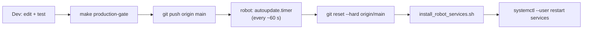

# 08 - Development Workflow

## Git workflow (REQUIRED — from CLAUDE.md)

> [!important] Commit and push after every single change
> After each edit (or set of edits) that leaves the repo in a coherent state:
> ```bash
> git add -A
> git commit -m "<clear message>"   # end with the Co-Authored-By trailer
> git push
> ```

- Work on and push to **`main`**.
- **Do not batch** many changes into one commit — commit each change as made.
- Every commit message must end with:
  `Co-Authored-By: Claude Opus 4.8 (1M context) <noreply@anthropic.com>`

## Push to `main` = deploy to robot

Pushing to `main` **is** the deploy mechanism. The robot's
`robot-telemetry-web-autoupdate.timer` pulls `origin/main` every ~60 s and, on
change, re-runs the installer and restarts services (see
[[02 - Network & Hosts#Auto-update timer (auto-deploy)]]).



> [!warning] Consequence
> Anything on `main` reaches the robot within ~60 s and restarts services. Ship
> risky features **dark** behind default-off flags (`MCP_ENABLED=0`, planned
> `TRACKING_ENABLED=0`) so an autoupdate deploy never silently opens a surface.
> See [[05 - Chat & MCP Tools]] and [[06 - Person Tracking (CV Feature)]].

## Running tests

```bash
cd /Users/vodafone/Workspace/humanoid-robot-gui
python3 -m unittest discover -s tests -p 'test_*.py'   # or: make test
```

All tests run **offline** — no DDS, no robot, no network. See [[10 - Testing]]
for the full suite inventory.

## The production gate

```bash
make production-gate        # → python3 scripts/production_gate.py
```

`scripts/production_gate.py` is an **offline** release gate (it must not require
robot access and must not publish DDS commands). It:

- Enumerates git-tracked files (`git ls-files`).
- Compiles/checks owned Python (`server.py`, `tests/`, plus `deployment/` and
  `tools/` prefixes) — so new `.py` files must at least compile.
- `node --check` on owned static JS (`static/app.js`, `static/viewer.js`) —
  the only JS syntax check (there is no JS test harness).
- **Excludes** `execution/`, `simulation/`, `teleoperation/.../external/`, `vendor/`.
- `--live` is an explicit robot reachability/service check, only after the offline gate passes.

The person-tracking plan requires `make production-gate` to pass **before every push**.

## Local development (no robot)

```bash
# via helper (kills stale servers, foreground)
python3 run_servers.py --mode foreground --host 0.0.0.0 --port 8088 --no-kill-first
# or directly
python3 -u server.py --host 127.0.0.1 --port 8090 --domain 0
```

Open `http://127.0.0.1:8088`. Without CycloneDDS / `unitree_sdk2py`, telemetry
won't connect (`connected: false`, `sample_rate_hz: 0`) — expected for UI-only
work. You can still verify the UI, static assets, and 3D model. Stop with
`python3 kill_servers.py`.

> [!note] Frontend has no build step
> Plain HTML/CSS/browser JS with vendored Three.js — **no Node/npm required**.
> Easier deployment on robot PCs. After code changes, at minimum run the tests
> and `git status --short --branch`. When changing README/operator docs, verify
> runtime paths, endpoint names, and systemd files still agree with the code.

## Robot deployment (manual bootstrap)

```bash
ssh unitree@10.2.100.142
cd /home/unitree/robot_telemetry_web
deployment/install_robot_services.sh   # installs user services + XR patches, restarts
```

The installer updates the `unitreerobotics/xr_teleoperate` checkout, copies user
service files, applies repo patch scripts to the XR checkout, `daemon-reload`,
and enables/restarts services. If an XR patch no longer matches upstream, restart
services manually (see README "Running on the Robot").

## Related

[[02 - Network & Hosts]] · [[10 - Testing]] · [[03 - Safety Interlocks]] · [[06 - Person Tracking (CV Feature)]]
</content>
