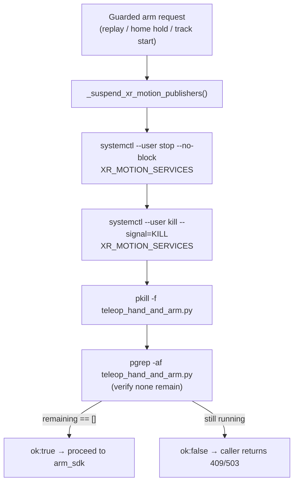

# 11 - Teleoperation (Vision Pro & XR)

> [!abstract] What XR teleop is
> A separate **Unitree upstream** stack (`xr_teleoperate`) lets an operator wearing
> an Apple Vision Pro (or any WebXR headset) drive the H1-2's **arms and hands**
> by hand-tracking. The headset opens a **Vuer** web page served over HTTPS by
> the robot; the teleop process retargets tracked hand/arm poses to the H1-2 arm
> joints and publishes them on DDS `rt/arm_sdk`. This is a **different control
> surface** from the dashboard's guarded arm endpoints, and the two must never
> publish to the arm path at the same time — see 03 - Safety Interlocks and
> the suspension logic below.

Sources: `README.md` "Camera and XR" / "Services" / "Troubleshooting"; the
integration repo `teleoperation/vision_pro_control/` (README + `docs/control_path.md`);
`deployment/systemd/xr-teleop.service`; `deployment/xr_home_watchdog.py`; and the
XR symbols in `server.py` (`XR_MOTION_SERVICES`, `_suspend_xr_motion_publishers`,
`switch_xr_mode`, `_request_xr_ipc`).

## Where the code lives

The dashboard repo **does not** contain the teleop implementation. It vendors
Unitree's `xr_teleoperate` as a git **submodule** inside a thin local
integration repo:

| Path | What it is |
| --- | --- |
| `teleoperation/vision_pro_control/` | Local integration repo: launch scripts + config around upstream |
| `teleoperation/vision_pro_control/external/xr_teleoperate` | **Submodule** — Unitree's XR teleop (`teleop/teleop_hand_and_arm.py`, `robot_control/`) |
| `teleoperation/vision_pro_control/external/unitree_sim_isaaclab` | **Submodule** — Unitree Isaac Lab simulator |
| `teleoperation/vision_pro_control/scripts/run_h1_2_vision_pro.sh` | Wrapper that launches upstream `teleop_hand_and_arm.py` |
| `teleoperation/vision_pro_control/docs/control_path.md` | Notes on the upstream H1-2 control path & joint order |

The two submodules are declared in
`teleoperation/vision_pro_control/.gitmodules` (URLs
`github.com/unitreerobotics/xr_teleoperate` and `.../unitree_sim_isaaclab`).
The related **semantic** teleop submodules are a separate topic — see
21 - Semantic Teleoperation Pipeline.

## The launch command

`run_h1_2_vision_pro.sh` runs upstream:

```bash
python teleop_hand_and_arm.py --input-mode hand --display-mode immersive \
  --arm H1_2 --img-server-ip 192.168.123.164 --network-interface eth0 --motion
```

Defaults (`vision_pro_control/README.md`): robot `H1_2`, DDS interface `eth0`,
input mode `hand`, display `immersive`, image server `192.168.123.164`.

> [!note] `--motion` decides the DDS topic
> - **With `--motion`**: publishes to `rt/arm_sdk` and writes `q = 1.0` to the
>   reserved arm-sdk **weight slot 27** (the enable weight). This is the mode the
>   deployed service uses and the reason it *fights* dashboard arm commands.
> - **Without `--motion`** (`--no-motion`): publishes to `rt/lowcmd` instead.
> - `rt/lowstate` is the feedback topic either way.
>
> H1-2 right-arm joint order per `docs/control_path.md`: 20 shoulder pitch, 21
> shoulder roll, 22 shoulder yaw, 23 elbow pitch, 24 elbow roll, 25 wrist pitch,
> 26 wrist yaw. Right wrist yaw = index **26** — the same index the dashboard's
> guarded wrist path uses (see [[16 - Arm Control & Command Surfaces]] and
> 03 - Safety Interlocks).

## The Vuer / XR page (headset entry point)

On the robot the XR server runs as `xr-teleop.service`
(`XR_TELEOP_VUER_PORT=8012`), served over HTTPS on the robot's Wi-Fi address.
Open in the headset's browser (README "XR page does not open"):

```text
https://10.2.100.142:8012/?ws=wss://10.2.100.142:8012
```

- The camera panel on the dashboard **links** to this page (and to the direct
  camera page). See [[12 - Camera & Video Streaming]].
- The browser must **trust the `televuer` root CA** and grant camera, hand
  tracking, and WebXR permissions or the XR session will not stay connected.

> [!warning] Two different ports in the docs — verify before use
> The **deployed** `xr-teleop.service` and `README.md` use port **8012**. The
> `vision_pro_control/README.md` launch example uses **8013**
> (`https://10.2.100.142:8013/?ws=wss://10.2.100.142:8013`) and mentions the
> `https://vuer.ai?ws=...` fallback. The port depends on how teleop was started
> (`XR_TELEOP_VUER_PORT`). On the current robot service it is 8012.

## XR control modes — `POST /api/xr/mode`

`switch_xr_mode` (in `server.py`) rewrites a systemd drop-in
(`XR_TELEOP_MODE_DROPIN = ~/.config/systemd/user/xr-teleop.service.d/10-control-mode.conf`)
and restarts `xr-teleop.service` to change how the headset's head/body pose maps
to the robot. Modes (each toggles env vars on the service):

| `mode` | Label | Env set |
| --- | --- | --- |
| `pad` | (default) | `XR_ROOT_CHILDREN_VISUAL=1`, `XR_HEAD_TILT_LOCO=0`, `XR_POSITION_MATCH_LOCO=0` |
| `head_tilt` | Head Rotation Control | `XR_ROOT_CHILDREN_VISUAL=0`, `XR_HEAD_TILT_LOCO=1`, `XR_POSITION_MATCH_LOCO=0` |
| `position_match` | Position Matching | `XR_ROOT_CHILDREN_VISUAL=0`, `XR_HEAD_TILT_LOCO=0`, `XR_POSITION_MATCH_LOCO=1` |

Any other value → **400**. The switch does `daemon-reload`, `kill --signal=KILL
xr-teleop.service`, then `restart --no-block`. Related locomotion coupling is in
15 - Locomotion Control.

## XR IPC — home / straight commands

The dashboard can send commands **into** the running teleop process over its IPC
channel (`teleop.utils.ipc.IPC_Client`) via `_request_xr_ipc(command, message)`,
which spawns a short Python subprocess that connects, waits for the client to be
online, and sends the command:

| Dashboard action | XR IPC command | Notes |
| --- | --- | --- |
| `POST /api/robot/straight` → `request_straight` | `CMD_STRAIGHT` | Straight-arm hold; XR arm tracking paused. **202** on ok |
| `POST /api/robot/home` → `request_home` | XR IPC first, then arm_sdk hold | Tries the XR IPC home; falls back to the closed-loop arm_sdk hold when DDS is available |

Returns **202** on success, **502** if the command is rejected, **504** on
timeout. `request_home` prefers the real arm_sdk hold on the robot; the XR IPC
path is the legacy fallback (see [[16 - Arm Control & Command Surfaces]]).

## Why XR publishers must be suspended (safety)

The XR teleop `--motion` process publishes to `rt/arm_sdk` continuously. If a
**dashboard** arm session (arm replay, Home hold, or the planned
person tracking) also published, two
controllers would fight over the same joints. So every guarded arm entry point
calls `_suspend_xr_motion_publishers()` **first**:



- `XR_MOTION_SERVICES = ("xr-home-watchdog.service", "xr-teleop.service")` and
  `XR_TELEOP_PROCESS_PATTERN = "teleop_hand_and_arm.py"` (`server.py` module top).
- Returns a **dict** `{"ok": ..., "services": [...], "remaining_processes": [...],
  "actions": [...]}` — *not* a tuple.
- **Skipped** (returns `{"ok": True, "skipped": True}`) when `RTW_SKIP_XR_SUSPEND=1`
  or when `systemctl` is absent (dev machines).
- Callers gate on `ok`: arm replay returns **409** if suspend failed
  (`server.py` ~L2717); Home hold returns **409** (~L4912); track start returns
  **503** (~L4273). This is **Layer 3** of the safety model —
  03 - Safety Interlocks.

> [!warning] Suspending XR ends the headset session
> Because suspension `KILL`s `xr-teleop.service`, an operator wearing the headset
> loses teleop the moment anyone presses Home / starts a replay / starts
> tracking. This is intentional — only one owner of `rt/arm_sdk` at a time
> (03 - Safety Interlocks).

## Home watchdog (`xr-home-watchdog.service`)

`deployment/xr_home_watchdog.py` protects against a headset that **disconnects
mid-session** (Wi-Fi drop, operator removes the headset) leaving the arms
wherever teleop last commanded them.

- Polls (default 0.5 s) two things: **established TCP clients** on the XR port
  (`ss -Htan`, default `--xr-port 8012`) and the teleop **IPC state**
  (`IPC_Client`, `START` flag). A session is "active" only when there is a
  connected client **and** IPC is online **and** `START` is set.
- When an active session is **lost**: immediately requests a loco `stop_move`
  (`POST /api/loco/command`, repeated every 0.5 s), and after
  `--lost-seconds` (default **5 s**) posts `POST /api/robot/home` to stiffen the
  arms into a safe hold. Then re-arms.
- Log: `/home/unitree/logs/xr_home_watchdog.log`.
- The watchdog is itself in `XR_MOTION_SERVICES`, so it is stopped alongside
  `xr-teleop.service` when the dashboard suspends XR.

## Services & certs

| Service | Purpose | Port |
| --- | --- | --- |
| `xr-teleop.service` | Vuer XR teleop server (upstream `start_xr_teleop.sh`) | `8012` (`XR_TELEOP_VUER_PORT`) |
| `xr-home-watchdog.service` | Home-on-disconnect watchdog | watches XR `8012`, calls dashboard `8088` |

`xr-teleop.service` sets `XR_NETWORK_INTERFACE=eth0`, `XR_TELEOP_EE=inspire_dfx`,
`XR_TELEOP_FREQUENCY=30`, hand-input/gain tuning env, and starts *after*
`teleimager.service` and `inspire-hands.service`. HTTPS certs come from
`XR_TELEOP_CERT` / `XR_TELEOP_KEY` (shared with TeleImager —
[[12 - Camera & Video Streaming]]). The robot checkout is patched on install by
the `deployment/patch_xr_*.py` / `.sh` scripts (hand input swap, dex-retargeting,
head-tilt loco, image client/server, etc.). See 22 - Deployment & Runtime Services.

## Related

[[12 - Camera & Video Streaming]] · [[16 - Arm Control & Command Surfaces]]
