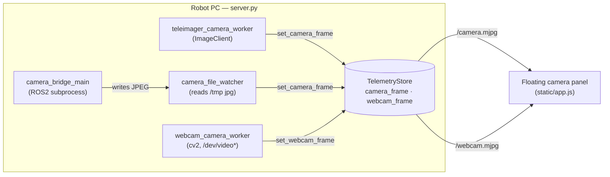

# 12 - Camera & Video Streaming

> [!abstract] Goal
> Get live video from the robot into the operator's browser. Two independent
> feeds run in `server.py`: the **head camera** (via Teleimager or a ROS2 H.264
> bridge, backend-selectable) and a **secondary USB webcam** plugged into the
> robot PC. Each is decoded to JPEG, held as the latest frame in `TelemetryStore`,
> and pushed to the dashboard's floating camera panel as an **MJPEG
> `multipart/x-mixed-replace`** stream.

Sources: `server.py` (`start_camera_bridge`, `teleimager_camera_worker`,
`camera_bridge_main`, `camera_file_watcher`, `webcam_camera_worker`,
`_send_mjpeg`, `camera_snapshot` / `webcam_snapshot`, `TelemetryStore` camera
state), `static/app.js` (`setupFloatCam`, `/camera.mjpg` / `/webcam.mjpg`
attach), `static/index.html` (floating camera panel).

## Two feeds, one panel

| Feed | Worker | Source | Browser stream | Snapshot API |
| --- | --- | --- | --- | --- |
| **Head camera** | `teleimager_camera_worker` or the ROS2 `camera_bridge_main` subprocess | robot front camera | `GET /camera.mjpg` | `GET /api/camera` |
| **USB webcam** | `webcam_camera_worker` | `/dev/video*` on the robot PC | `GET /webcam.mjpg` | `GET /api/webcam` |

Both are shown in the dashboard's **floating camera bubble** (`setupFloatCam`
in `static/app.js`): a draggable, corner-resizable panel with the head camera on
top (`floatCamStream` → `/camera.mjpg`) and the webcam below (`floatWebcamStream`
→ `/webcam.mjpg`). Each `` `src` is set with a `?float=<timestamp>`
cache-buster when the panel opens and cleared when it minimizes.

## Head-camera backends (`CAMERA_BACKEND`)

`start_camera_bridge(store)` reads `store.camera_backend` (env `CAMERA_BACKEND`,
default `auto`) and starts workers accordingly:

| Backend | What starts | Head-camera source |
| --- | --- | --- |
| `auto` (default) | `teleimager_camera_worker` **only** for the head camera | Teleimager `ImageClient.get_head_frame()` |
| `teleimager` | Same as `auto` | Teleimager |
| `ros2` | The `camera_bridge_main` subprocess + `camera_file_watcher` (no Teleimager worker) | ROS2 `/frontvideostream` H.264 |

The **USB webcam worker is always started**, independent of the head-camera
backend (`start_camera_bridge` launches it unconditionally before the backend
switch).

> [!note] `auto` == `teleimager`
> In the current code `auto` and `teleimager` behave identically — both start
> only the Teleimager worker for the head camera. The ROS2 H.264 bridge runs
> **only** when `CAMERA_BACKEND=ros2` is set explicitly.

### Teleimager path

Teleimager (`teleimager.image_client.ImageClient`) is imported from whichever
of `TELEIMAGER_PATHS` exists — first
`teleoperation/vision_pro_control/external/xr_teleoperate/teleop/teleimager/src`,
else `~/teleimager/src` — inserted onto `sys.path` at import time. The worker
connects to `TELEIMAGER_HOST` (default `127.0.0.1`, `request_bgr=False`), polls
`get_head_frame()` at ~25 Hz (`time.sleep(0.04)`), and only accepts frames that
start with the JPEG magic `\xff\xd8`. On any exception it closes the client and
retries after 1 s. Its `camera_topic` label is set to `teleimager/head`. See
21 - Semantic Teleoperation Pipeline and 11 - Teleoperation (Vision Pro & XR).

### ROS2 H.264 bridge

For `CAMERA_BACKEND=ros2`, `start_camera_bridge` launches a **separate Python
subprocess** (`sys.executable … --camera-bridge`) running `camera_bridge_main`:

- It subscribes to the ROS2 topic **`/frontvideostream`** (`unitree_go.msg
  Go2FrontVideoData`) after `configure_ros2_camera_environment(interface)` sets
  `RMW_IMPLEMENTATION=rmw_cyclonedds_cpp` and a `CYCLONEDDS_URI` pinned to the
  robot network interface.
- `h264_payload_from_video_msg` picks the H.264 stream at
  `CAMERA_RESOLUTION` (`720`/`360`/`180`, default **360**), falling back through
  the other resolutions if the requested one is empty.
- A decoder thread accumulates the H.264 byte-stream (capped at ~4 MB,
  re-aligned on the `00 00 00 01` start code), throttles to one decode every
  ~0.2 s, decodes via OpenCV/FFmpeg (`decode_h264_file`), and writes the JPEG
  atomically to `/tmp/robot_telemetry_front_camera.jpg` (`CAMERA_JPEG_PATH`).
- `camera_file_watcher` (a thread in the main process) polls that file every
  0.1 s and calls `set_camera_frame` when the mtime changes and the bytes start
  with `\xff\xd8`.

> [!warning] The ROS2 camera bridge subprocess is **not auto-restarted**
> `start_camera_bridge` launches the bridge once via `subprocess.Popen` and
> stores it as `store.camera_process`; the only other reference is
> `camera_process.terminate()` at server shutdown. There is **no monitor thread
> that restarts it if it dies** (e.g. a decode crash or a lost ROS2 graph). If
> the subprocess exits, `camera_file_watcher` keeps reporting *"Waiting for
> camera bridge frame."* indefinitely and the head feed goes dark until the
> whole server is restarted. Restarting the server (see
> 22 - Deployment & Runtime Services) is currently the only recovery.

## USB webcam worker

`webcam_camera_worker` streams a plain USB webcam on the robot PC and
**auto-recovers** (unlike the head bridge):

- Imports `cv2` (ships with the teleimager env); reports an error frame if
  unavailable.
- Scans `sorted(glob.glob("/dev/video*"))`, probes each with
  `cv2.VideoCapture` until one delivers a frame, and requests 1280×720.
- Downscales frames wider than 960 px, JPEG-encodes at quality 80, and calls
  `set_webcam_frame` at ~15 fps.
- If no device is present or a device stops delivering, it sets a descriptive
  error (*"No USB webcam detected…"*, *"…none delivers frames yet."*,
  *"Webcam stopped delivering frames; rescanning."*) and **retries forever every
  few seconds**, so the feed lights up the moment a webcam appears.

## MJPEG streaming to the browser

Both `/camera.mjpg` (`_send_camera_stream`) and `/webcam.mjpg`
(`_send_webcam_stream`) delegate to `_send_mjpeg(wait_for_frame)`:

- Response is `Content-Type: multipart/x-mixed-replace; boundary=frame` with
  `Cache-Control: no-cache`, `Pragma: no-cache`, `X-Accel-Buffering: no`.
- A loop calls `wait_for_camera_frame` / `wait_for_webcam_frame`, which block on
  a `threading.Condition` until a **new-timestamped** frame arrives (1 s
  timeout), so each client only gets a part when the frame actually changed.
- Each part is `--frame` + `Content-Type: image/jpeg` + `Content-Length` + the
  JPEG bytes. A dropped/half-open client (`OSError`, incl. TLS `SSLError`)
  breaks the loop cleanly.

Frames live in `TelemetryStore` behind per-feed locks/conditions
(`camera_lock`/`camera_condition`, `webcam_lock`/`webcam_condition`).
`set_camera_frame`/`set_webcam_frame` stamp `*_timestamp = time.time()`, clear
the error, and `notify_all()` waiting stream loops.

## Snapshot / status APIs

| Path | Method | Returns (`server.py`) |
| --- | --- | --- |
| `/api/camera` | GET | `camera_snapshot()`: `source` (topic), `interface`, `backend`, `resolution`, `available`, `timestamp`, `error` |
| `/api/webcam` | GET | `webcam_snapshot()`: `source: "usb-webcam"`, `available` (false if last frame > 5 s stale), `timestamp`, `error` |
| `/camera.mjpg` | GET | Head-camera MJPEG stream |
| `/webcam.mjpg` | GET | USB-webcam MJPEG stream |

See the consolidated list in 04 - HTTP API Reference.

## Startup, interface & disabling

`main()` wires the camera at boot (`server.py`):

- `--camera-source` / `CAMERA_SOURCE` — the DDS network interface; when blank it
  falls back to `route_interface(robot_host)` then `default_interface()`.
- `--camera-resolution` / `CAMERA_RESOLUTION` (default 360),
  `--camera-backend` / `CAMERA_BACKEND` (`auto`/`teleimager`/`ros2`).
- `--disable-camera` skips `start_camera_bridge` entirely and sets the error
  *"Camera worker disabled for this server run."*
- `--camera-bridge` is the internal flag the ROS2 subprocess is re-invoked with;
  it runs `camera_bridge_main` and returns without starting the dashboard.

> [!note] The head camera also feeds person tracking
> `TRACKING_CAMERA` (default `head`) selects which feed drives the sentry /
> person-following detector — see 06 - Person Tracking (CV Feature),
> 07 - Detection Service (YOLO) and 19 - Sentry Mode & Head-Lock. The
> `robot_telemetry_front_video_bridge` ROS2 node name and `/frontvideostream`
> topic show up in the ROS graph tools (05 - Chat & MCP Tools).

