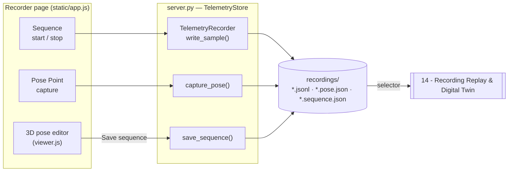

# 13 - Telemetry Recording & Pose Editor

> [!abstract] Goal
> Capture the H1-2's **full-body pose over time** (or a single target pose), save
> it under `recordings/`, and let the operator hand-edit poses in the 3D viewer
> with a **6-DOF hand-target panel** backed by IK and self-collision checks. The
> output feeds the digital-twin replay ([[14 - Recording Replay & Digital Twin]]),
> offline simulation export, debugging, and imitation-learning datasets.

Sources: `server.py` (`TelemetryRecorder`, `TelemetryStore.start_recording` /
`stop_recording` / `capture_pose` / `save_sequence` / `rename_recording` /
`recording_files`), README "Telemetry Recording" (§531) and "Features" (§109),
`static/viewer.js` (pose editor / hand-target panel), `static/app.js` (IK status).

## Capture modes

The Recorder page supports three write paths (README §533, `server.py`):

| Mode | File suffix | Schema | Endpoint / method | What it stores |
| --- | --- | --- | --- | --- |
| **Sequence** (process recording) | `.jsonl` | `h1_2_telemetry_jsonl_v1` | `POST /api/recording/start` → `stop` | Every `rt/lowstate` sample over time, one record per line |
| **Pose Point** | `.pose.json` | `h1_2_pose_point_v1` | `POST /api/recording/pose` | One captured full-body snapshot (target point) |
| **Sequence save** (from 3D editor) | `.sequence.json` | `h1_2_sequence_v1` | `POST /api/recording/sequence` | An ordered `points` array of edited poses |

All recordings live under:

```text
recordings/
```

which is intentionally **git-ignored** (`RECORDINGS_DIR`) because sequences grow
fast. Filenames are `{recording_timestamp()}-{safe_label}{suffix}`; the label is
sanitized to `[A-Za-z0-9_-]`, trimmed, capped at 48 chars.



## Sequence JSONL schema (`h1_2_telemetry_jsonl_v1`)

`TelemetryRecorder` writes one JSON record per line. Record `type` values
(README §551):

| `type` | When | Contents |
| --- | --- | --- |
| `recording_start` | On `start(label)` | `schema`, `timestamp`, `monotonic_ns`, `body_joint_names` (`JOINT_NAMES`), `hand_joint_names` (`HAND_JOINT_NAMES`) |
| `telemetry_sample` | Per sampled frame | one `rt/lowstate` frame + latest `rt/inspire/state` hand state (see below) |
| `command_event` | Dashboard command markers | loco, wrist, home, chill, XR mode requests (`record_command_event`) |
| `recording_stop` | On `stop()` | final `samples` + `events` counts |

Each `telemetry_sample` carries (README §562):

- Wall-clock `timestamp` **and** monotonic `monotonic_ns` (for precise ordering).
- **Body motor rows** for every `rt/lowstate` motor slot the robot exposes
  (legs, waist, arms). Each row: `index`, `name`, `mode`, `q`, `dq`, `ddq`,
  `tau`, `tau_est`, `temperature`, `vol`, `sensor`, `reserve` (when present).
- IMU values, robot mode fields, and battery / foot force / estimated foot force
  when exposed. See [[18 - Body, IMU, Battery & Hand Telemetry]].
- **RH56BFX / Inspire hand** joint rows from the latest hand state
  (`rt/inspire/state`). See [[18 - Body, IMU, Battery & Hand Telemetry]].

> [!note] `TelemetryRecorder` bookkeeping
> `status()` reports `active`, `path`/`filename`, `started_at`,
> `elapsed_seconds`, `samples`, `events`, `bytes_written`, `last_sample_at`,
> `last_error`. `start()` is idempotent — calling it while a recording is open
> returns the existing status without opening a second file.

## Pose Point & Sequence (target poses)

- `capture_pose(payload)` deep-copies the current live `latest` snapshot (or a
  client-supplied `snapshot`), **refuses with 409** if no body `motors` are
  present, and writes a `pose_point` record (`h1_2_pose_point_v1`). When
  replayed, the **red** model shows this target and the **green** model animates
  toward it ([[14 - Recording Replay & Digital Twin]]).
- `save_sequence(payload)` requires a **non-empty `points` array**; each point
  must contain `motors` (else 400). Points are stamped with default `timestamp`
  spacing of `TRAJECTORY_DEFAULT_DT` (1/60 s) and written as `h1_2_sequence_v1`.

## `/api/recording/*` surface

| Path | Method | Behavior |
| --- | --- | --- |
| `/api/recording/status` | GET | `recorder.status()` |
| `/api/recording/files` | GET | Lists `*.jsonl`, `*.pose.json`, `*.sequence.json`; custom-named first, then newest |
| `/api/recording/files/<name>` | GET | Download a recording (path-traversal guarded to `recordings/`) |
| `/api/recording/start` | POST | Start a JSONL recording (`label`) |
| `/api/recording/stop` | POST | Stop the active recording |
| `/api/recording/pose` | POST | Capture current pose as a `.pose.json` |
| `/api/recording/sequence` | POST | Save an edited `points` sequence as `.sequence.json` |
| `/api/recording/rename` | POST | Rename a recording (`name` + new `label`) |
| `/api/recording/replay/robot` | POST | Replay planning / locked playback → [[14 - Recording Replay & Digital Twin]] |

See the consolidated table in [[04 - HTTP API Reference]].

## Named positions (rename → the `move` target set)

`rename_recording` keeps the file's timestamp prefix and swaps the label. A file
counts as **`custom_named`** once its label is no longer in
`AUTO_RECORDING_LABELS`. `named_positions()` maps each custom-named recording to
a normalized position name (newest wins on collision) — **exactly the targets the
chat/[[05 - Chat & MCP Tools|MCP]] `move` tool can drive to** and the dashboard
"Move" button replays. So *renaming a saved pose is what turns it into a
commandable position*. See [[14 - Recording Replay & Digital Twin#Closed-loop arm replay (the allowed path)]].

## 6-DOF hand-target pose editor

The 3D viewer ([[17 - 3D URDF Viewer]]) lets the operator drag the hand balls to
retarget the arms via IK. A **press without dragging is a click** (`viewer.js`
~L628) and opens a hovering **6-DOF target panel** (`viewer.js` §1328), per
README §134:

| Control | Detail |
| --- | --- |
| **X / Y / Z position** | With a **Ground / Relative frame toggle** — *ground* = X/Y from the pelvis axis, Z from the fixed floor; *relative* = offsets from the hand's pre-edit position |
| **Wrist roll / pitch / yaw** | Sliders bounded by the **real URDF joint limits** |

- Panel edits drive the **same IK and self-collision path as dragging**
  (`LEFT_ARM_IK_JOINTS` / `RIGHT_ARM_IK_JOINTS`); the **wrist is kept out of the
  position IK chain** and set directly (`viewer.js` ~L806, ~L1351).
- Edits only change the **preview pose** — nothing is sent to the robot here.
- Status surfaces in the UI (`app.js` ~L1436, `viewer.js` ~L1539):
  `IK solved · N cm`, `IK near limit`, `IK unreachable`, or
  **`Blocked: self-collision`** when the solved pose self-intersects.

> [!note] Edit → save → command
> Edited poses become commandable only after they are **saved** (`.pose.json` /
> `.sequence.json`) and, for the `move` tool, **renamed**. The pose editor itself
> never publishes a motor command; the arm only moves through the guarded
> closed-loop arm replay path — see [[14 - Recording Replay & Digital Twin]] and
> [[16 - Arm Control & Command Surfaces]].

## Safety posture

> [!warning] Recording is read-only; raw replay is not enabled
> Recording only **reads** telemetry. Replaying **raw** recorded joint
> trajectories back onto the physical robot is intentionally **not** implemented
> — it needs controller-ownership checks, interpolation, velocity/torque limits,
> emergency-stop supervision, and simulation validation first. The only motion a
> recording can drive is the **closed-loop arm replay to a saved pose**
> ([[14 - Recording Replay & Digital Twin]]). See [[03 - Safety Interlocks]].

## Related

[[14 - Recording Replay & Digital Twin]] · [[16 - Arm Control & Command Surfaces]] · [[17 - 3D URDF Viewer]] · [[18 - Body, IMU, Battery & Hand Telemetry]] · [[04 - HTTP API Reference]] · [[05 - Chat & MCP Tools]] · [[03 - Safety Interlocks]] · [[09 - Glossary]]
