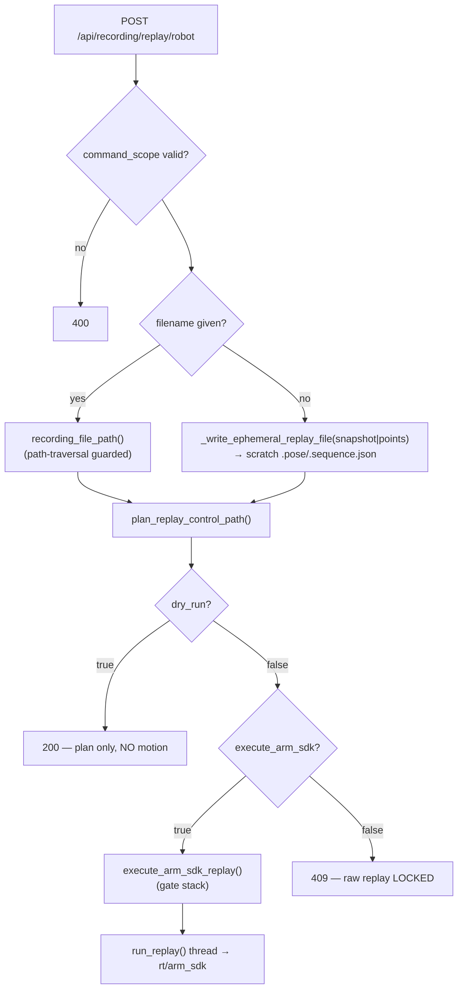

# 14 - Recording Replay & Digital Twin

> [!abstract] Goal
> Take a saved (or unsaved, edited) pose/sequence and either **preview** it on the
> digital-twin ghost models or **drive the physical arms onto it** through the one
> validated, closed-loop `rt/arm_sdk` path. Everything hard-locked out of that path
> (raw joint replay, leg motion, finger publishing) stays locked. Recordings come
> from [[13 - Telemetry Recording & Pose Editor]]; the command substrate is
> [[16 - Arm Control & Command Surfaces]].

Sources: `server.py` (`request_robot_replay`, `plan_replay_control_path`,
`execute_arm_sdk_replay`, `_smooth_arm_replay_frames`, `_closed_loop_arm_targets`,
`_cap_playback_speed`, `_arm_replay_tuning`, `_plan_hand_trajectory`,
`_select_trajectory_gains`, `_write_ephemeral_replay_file`, `_clamp_joint_target`),
`docs/trajectory_executor_integration.md`, `docs/robot_control_paths.md`,
`docs/arm_sdk_replay_flow.drawio`, `static/viewer.js` (ghost models).

## The digital twin: three ghost models

The 3D viewer (17 - 3D URDF Viewer) renders overlaid ghost models so the
operator sees intent vs. reality before any command
(`docs/trajectory_executor_integration.md`):

| Colour | Meaning |
| --- | --- |
| **Blue** | Current robot / reference pose (live `rt/lowstate`) |
| **Red** | Target pose, or the current sequence frame being executed |
| **Green** | Simulated trajectory preview (no motor commands) |

The green simulation is a pure preview; nothing is published while it plays. The
LLM pose-proposal green preview works the same way — the operator approves the
**green** ghost before the red/live arms move (20 - LLM Arm Pose Proposals & Mimic).

## `/api/recording/replay/robot` — one endpoint, three outcomes

`request_robot_replay(payload)` is the single entry point. It validates
`command_scope` (`all` · `arms` · `both_arms` · `right_arm` · `left_arm`), resolves
the recording (or writes an **ephemeral** file for an unsaved editor pose/sequence),
builds the plan, then branches on the payload:

- **`dry_run:true`** → 200 `{plan}`, no motion. This is the digital-twin planner.
- **`execute_arm_sdk:true`** → the gate stack (below), then the closed-loop thread.
- **neither** → **409 LOCKED**: raw recorded joint replay to the physical robot is
  intentionally disabled ("requires a safety controller with interpolation,
  joint/velocity/torque limits, controller-ownership checks, and emergency-stop
  supervision"). This mirrors the read-only posture in
  [[13 - Telemetry Recording & Pose Editor]].

> [!note] Unsaved poses are validated identically
> A filename-less replay (an edited pose/sequence dragged in the 3D editor, or an
> LLM proposal) is serialized to a scratch file under `recordings/.ephemeral/`
> using the **same on-disk schema** as `capture_pose`/`save_sequence`, run through
> the identical pipeline, then deleted in a `finally`. No interlock is bypassed.
> The scratch filename includes pid + a per-process counter and is created with
> `open(..., "x")` so concurrent replays can't clobber each other's trajectory.

## Dry-run planning (`plan_replay_control_path`)

The planner walks every frame, tracks per-joint max step and velocity relative to
the current live pose, and produces the plan struct
(`docs/trajectory_executor_integration.md`):

| Field | Meaning |
| --- | --- |
| `control_path` | `arm_sdk` if **no lower-body joint** moves beyond the threshold, else `lowcmd` |
| `reason` | Human-readable path justification |
| `valid_for_execution` | `frames present AND zero violations` |
| `commanded_body_joints`, `moving_joints`, `moving_lower_body_joints` | Joint sets (index+name) |
| `max_frame_delta_rad`, `max_velocity_rad_s` | Worst-case observed |
| `gain_plan[]` | Per-joint `kp`/`kd` (demand-scaled — see below) |
| `hand_plan` | RH56/Inspire finger plan (publishing locked) |
| `duration_seconds`, `frame_count`, `limits`, `violations[]` | Metadata + gate results |

### Control-path routing & limits

| Constant (`server.py`) | Value | Role |
| --- | --- | --- |
| `TRAJECTORY_ROUTE_EPSILON` | 0.015 rad | Lower-body "stationary" threshold → picks arm_sdk vs lowcmd |
| `TRAJECTORY_MAX_FRAME_DELTA_RAD` | 0.18 rad | Max frame-to-frame step (else `frame_delta` violation) |
| `TRAJECTORY_MAX_VELOCITY_RAD_S` | 2.0 rad/s | Max joint velocity (else `velocity` violation) |
| `TRAJECTORY_DEFAULT_DT` | 1/60 s | Default frame spacing when timestamps absent |
| `LOWER_BODY_JOINTS` | legs 0-11 | The joints that force the `lowcmd` route |

`docs/robot_control_paths.md` §Command Path Rule: **arm_sdk when the trajectory
does not move lower-body joints; lowcmd when any leg joint moves beyond the
stationary threshold.** `WaistYaw` is *not* lower body (the arm SDK path already
carries the waist slot).

### Non-finite & malformed rejection

- A `NaN`/`inf` target `q` passes every `NaN > limit` comparison (all False) and
  would then clamp to a joint limit — a large unvalidated move. It is rejected as a
  **`non_finite`** violation instead (`plan_replay_control_path` ~L4314).
- A motor with a non-numeric `index`/`q` (the save path doesn't type-check these)
  is coerced safely and, on failure, flagged **`malformed_motor`** — invalidating
  the whole plan.

Both make `valid_for_execution=false`, so `execute_arm_sdk_replay` refuses (409).

## The gate stack (`execute_arm_sdk_replay`)

> [!important] The closed-loop arm_sdk replay is the ONLY allowed motion-from-recording path
> Every other route (raw replay, the `lowcmd` leg path, finger publishing) is
> hard-locked. A recording reaches the motors **only** by passing all of these,
> fail-closed:

| # | Gate | Fail |
| --- | --- | --- |
| 1 | `plan.control_path == "arm_sdk"` | 409 — "Only arm_sdk arm/waist trajectories are enabled" (lowcmd/leg locked) |
| 2 | `plan.valid_for_execution` | 409 — trajectory failed safety validation |
| 3 | `plan.hand_plan.enabled` is **false** | 409 — finger execution not enabled; body trajectory **not** published |
| 4 | frames present | 400 |
| 5 | `wrist_publisher` (rt/arm_sdk) + `lowstate_msg` + `lowcmd_factory` + `crc` | 503 |
| 6 | `0.005 ≤ position_tolerance_rad ≤ 0.25` (finite; default `ARM_REPLAY_TOLERANCE_RAD=0.01`) | 400 |
| 7 | `_suspend_xr_motion_publishers().ok` | 409 — XR would overwrite arm_sdk (see [[16 - Arm Control & Command Surfaces]]) |

After the gates it caps playback speed, builds the gain maps, cancels any in-flight
replay, prepares the smooth approach, and launches the `run_replay` daemon thread —
returning **202** immediately (motion runs async). Status streams through
`/api/wrist/status`.

### Interpolation: velocity-bounded smooth approach

The move from the robot's **current measured pose** to the trajectory's **first
frame** is always prepended as a smootherstep (`3t²−2t³`) ramp
(`_smooth_arm_replay_frames`), regardless of closed-loop/direct mode — otherwise a
single-frame pose would be commanded in one step at full gains and snap.

| Constant | Value | Role |
| --- | --- | --- |
| `ARM_REPLAY_SMOOTH_APPROACH_SECONDS` | 4.5 s | Default ramp duration (stretched so peak vel stays bounded) |
| `ARM_REPLAY_APPROACH_PEAK_VEL_RAD_S` | 0.6 rad/s | Cap on the smootherstep peak velocity |
| `ARM_REPLAY_APPROACH_MIN_SECONDS` | 2.0 s | Floor for tiny moves |

### Playback-speed cap

`_cap_playback_speed(requested, native_max_vel)` bounds the effective speed so
`native_velocity × speed ≤ TRAJECTORY_MAX_VELOCITY_RAD_S` (2.0). The velocity gate
validates delta/dt at the recording's **native** timing, but the run loop sleeps
`DEFAULT_DT / playback_speed`, so a high `replay_response` dial could otherwise
drive validated setpoints faster than the validated envelope. Because a validated
trajectory's native velocity is already ≤ the limit, this never caps below 1.0.

### Gain plan (`kp`/`kd`)

`_select_trajectory_gains` starts from the raw base gains — for arm_sdk that's
`ARM_SDK_KP`/`ARM_SDK_KD` per joint — and demand-scales each: `scale ∈ [0.75, 1.15]`
by `max(step_ratio, velocity_ratio)` against `GAIN_NOMINALS`; non-moving joints get
0.75; `kd` scales by `√scale`. In `execute_arm_sdk_replay` those raw gains are then
multiplied by response-driven tuning scales — `inner_kp/kd_scale` (closed loop) or
`direct_kp/kd_scale` (open loop), softer `approach_*_scale` during the ramp, and
stiffer `ARM_REPLAY_HOLD_KP_SCALE=0.55` / `ARM_REPLAY_HOLD_KD_SCALE=1.2` during the
hold. Details in [[24 - Control Gains, PID & Shared Mechanisms]].

## Closed-loop convergence controller

`run_replay` has two phases. **Phase A** plays the (approach + recorded) frames.
**Phase B** servos onto the final pose via `_closed_loop_arm_targets` — a cascade of
an outer PID (`ARM_REPLAY_PID_GAINS` per group) plus a **gravity feed-forward** built
from measured `tau_est`, blended continuously by how *stationary* the joint is
(`ARM_REPLAY_GRAVITY_HOLD_SCALE=0.95` when settled, `…_MOVE_SCALE=0.5` while
reaching) and bounded per group by `ARM_REPLAY_GRAVITY_TAU_LIMITS`
(shoulder 15, elbow 10, wrist 4, waist 6 Nm). A bounded adaptive "learn" integral
nulls residual holding error without moving the setpoint.

> [!note] Convergence is the ONLY normal success exit
> A joint is "settled" only when inside `position_tolerance` **and** nearly
> stationary (`ARM_REPLAY_CONVERGE_VELOCITY_RAD_S=0.05`), latched with hysteresis
> (`×1.6`). Convergence additionally requires a small weighted end-effector proxy
> error (`ARM_REPLAY_CARTESIAN_TOLERANCE_M=0.006`), tracked over
> `settle_seconds` at `ARM_REPLAY_HOLD_HZ=120`. If it stalls above the band for
> `ARM_REPLAY_STALL_SECONDS=2.5`, effort escalates (bounded, `×2.0`). If it still
> hasn't converged by the absolute ceiling `ARM_REPLAY_ABSOLUTE_CEILING_SECONDS=90`,
> it enters a **flagged safe-hold** — it reports `converged=false` and never claims
> success or releases at the wrong pose. With `hold_after_convergence=true` it keeps
> holding the pose; otherwise it stops on convergence.

The command each cycle is `_build_arm_sdk_trajectory_cmd` with `weight=1.0` — the
onboard balance controller stays engaged (no motion-mode release), so the arms never
go limp between Moves.

## Finger / hand plan (planned, not published)

`_plan_hand_trajectory` reports a `hand_plan` for RH56BFX / Inspire finger motion
(`state_topic=rt/inspire/state`, `command_topic=rt/inspire/cmd`,
`HAND_TRAJECTORY_MAX_FRAME_DELTA=0.18`, `HAND_TRAJECTORY_MAX_VELOCITY=3.0`), but only
when `command_scope=all`; scoped arm replays disable it. **Publishing on
`rt/inspire/cmd` is not implemented** — if any finger moves (`hand_plan.enabled`),
Gate 3 refuses execution rather than moving the body without the hand. See
18 - Body, IMU, Battery & Hand Telemetry and
`docs/trajectory_executor_integration.md` §Not Yet Implemented.

## Flow diagram

The canonical end-to-end flow lives in `docs/arm_sdk_replay_flow.drawio` (viewable
via the docs diagram viewer, 17 - 3D URDF Viewer / `static/diagram.js`). It
diagrams `request_robot_replay → execute_arm_sdk_replay → run_replay`, the gate
stack, the `LowState_`/`LowCmd_` DDS structs, and the plan/tuning/pid-state structs.

> [!warning] The .drawio predates some current behavior
> The diagram still shows a **`preview_complete` gate**, a hard **10 s timeout**
> exit, a fixed **0.65/0.25** gravity split, and an observation that teardown never
> sends `weight=0`. The current code has moved on: preview is **no longer required**
> before playback (`request_robot_replay` comment ~L3428); the terminal is
> **convergence + a 90 s ceiling** (not a 10 s timeout); gravity uses the
> continuous `0.95/0.5` stationarity ramp plus an adaptive learn term. Trust
> `server.py` over the diagram where they disagree; the diagram's teardown-release
> observation is tracked in 25 - Known Issues & Optimization Audit.

## Related

[[13 - Telemetry Recording & Pose Editor]] · [[16 - Arm Control & Command Surfaces]] · [[24 - Control Gains, PID & Shared Mechanisms]] · [[03 - Safety Interlocks]]
