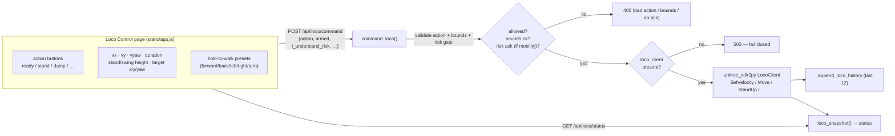

# 15 - Locomotion Control

> [!abstract] Goal
> Give the operator a **guarded surface onto the Unitree H1-2 `LocoClient`** —
> posture (stand / balance / height), whole-body **base mobility** (walk, turn,
> velocity, target-position), gait control, canned gestures, and read-only state
> queries — all through one server endpoint that validates every numeric bound
> and **fails closed** when the robot-side loco client is unavailable. Actions
> that actually translate the robot require an explicit **risk acknowledgement**;
> stops and posture never do.

Sources: `server.py` (`command_loco`, `LOCO_ACTIONS`, `LOCO_LIMITS`,
`LOCO_MOBILITY_ACTIONS`, `has_risk_ack`, `_coerce_float`, `loco_snapshot` /
`_loco_status_payload`, `_append_loco_history`, `_set_loco_status`, `_run`
LocoClient bring-up), `static/app.js` (`setupLocoControls`, `sendLocoCommand`,
`locoPayload`, `applyLocoPreset`, hold-to-walk), README "H1 locomotion controls".

## Where it lives



The `LocoClient` is imported from `unitree_sdk2py.h1.loco.h1_loco_client` and
brought up inside the telemetry thread (`_run`): `LocoClient()`,
`SetTimeout(5.0)`, `Init()`. On success `loco_status` flips to
`available=True, message="H1 loco client is ready."` Until then the endpoint
answers but reports the client as unavailable (see fail-closed below).

## The action set

`command_loco` accepts a single `action` string; unknown actions are **400**.
Each maps to one `LocoClient` method (a couple issue a stop first). `ok` is
`call_code in (0, None)` — a non-zero SDK return code comes back as **502**.

| `action` | LocoClient call | Class |
| --- | --- | --- |
| `ready`, `balance_stand` | `BalanceStand()` | posture |
| `stand_up` | `StandUp()` | posture |
| `high_stand` | `HighStand()` | posture |
| `low_stand` | `LowStand()` | posture |
| `set_height` | `SetStandHeight(stand_height)` | posture |
| `set_swing_height` | `SetSwingHeight(swing_height)` | posture |
| `set_balance_mode` | `SetBalanceMode(balance_mode)` | posture |
| `stop_move` | `SetVelocity(0,0,0,0.4)` | **stop** |
| `damp` | `SetVelocity(0,0,0,0.2)` → `SetFsmId(1)` | **stop / soft** |
| `zero_torque` | `SetVelocity(0,0,0,0.2)` → `SetFsmId(0)` | **stop / limp** |
| `start` | `Start()` | **mobility (gated)** |
| `velocity` | `SetVelocity(vx, vy, vyaw, duration)` | **mobility (gated)** |
| `move` | `Move(vx, vy, vyaw, continuous_move)` | **mobility (gated)** |
| `continuous_gait_on` | `ContinuousGait(True)` | **mobility (gated)** |
| `continuous_gait_off` | `ContinuousGait(False)` | gait |
| `next_foot_left` | `SetNextFoot(True)` | **mobility (gated)** |
| `next_foot_right` | `SetNextFoot(False)` | **mobility (gated)** |
| `set_target_position` | `SetTargetPos(target_x, target_y, target_yaw, target_relative)` | **mobility (gated)** |
| `wave_hand` | `WaveHand()` | gesture |
| `shake_hand` | `ShakeHand()` | gesture |
| `shake_hand_start` | `ShakeHand(0)` | gesture |
| `shake_hand_end` | `ShakeHand(1)` | gesture |
| `enable_odom` / `disable_odom` | `EnableOdom()` / `DisableOdom()` | odometry |
| `get_odom` | `GetOdom()` | read-only |
| `get_fsm_id` | `GetFsmId()` | read-only |
| `get_fsm_mode` | `GetFsmMode()` | read-only |
| `get_balance_mode` | `GetBalanceMode()` | read-only |
| `get_swing_height` | `GetSwingHeight()` | read-only |
| `get_stand_height` | `GetStandHeight()` | read-only |
| `get_phase` | `GetPhase()` | read-only |

The read-only `get_*` and `get_odom` actions return their SDK payload under
`result` in the response (`result_data`).

> [!note] `damp` vs `zero_torque`
> Both first command zero velocity, then switch FSM: `damp` → `SetFsmId(1)`
> (motors stop actively pushing / soft-hold) and `zero_torque` → `SetFsmId(0)`
> (torque released / limp). Neither is treated as a mobility action, so both
> stay **ungated** — stopping and softening the robot must always be possible.

## Bounds — `LOCO_LIMITS` and `_coerce_float`

Every numeric field is coerced with `_coerce_float(payload, name, default, low,
high)`: non-numbers and non-finite values raise → **400**; out-of-range values
raise → **400**. `LOCO_LIMITS` (echoed to the UI in the status payload) and the
call-site defaults are:

| Field | Range (`LOCO_LIMITS`) | Default | Used by |
| --- | --- | --- | --- |
| `vx` | `-1.0 … 1.0` m/s | `0.0` | `velocity`, `move` |
| `vy` | `-0.5 … 0.5` m/s | `0.0` | `velocity`, `move` |
| `vyaw` | `-1.0 … 1.0` rad/s | `0.0` | `velocity`, `move` |
| `duration` | `0.1 … 10.0` s | `1.0` | `velocity` |
| `stand_height` | `0.0 … 1.0` | `0.0` | `set_height` |
| `swing_height` | `0.0 … 0.3` | `0.05` | `set_swing_height` |
| `target_x` | `-2.0 … 2.0` m | `0.0` | `set_target_position` |
| `target_y` | `-2.0 … 2.0` m | `0.0` | `set_target_position` |
| `target_yaw` | `-3.14 … 3.14` rad | `0.0` | `set_target_position` |
| `balance_mode` | `0 … 1` (int) | `0` | `set_balance_mode` |

Two booleans ride alongside: `continuous_move` (passed to `Move`) and
`target_relative` (default **True**, passed to `SetTargetPos` — targets are
robot-relative unless the caller opts out).

## Safety gating — `LOCO_MOBILITY_ACTIONS` + `has_risk_ack`

Base-mobility actions require the **same explicit acknowledgement as the wrist
and tracking surfaces**: `has_risk_ack(payload)` demands `armed is True` **and**
`i_understand_risk is True`. Without both, the request is rejected **400**
before any SDK call:

```text
Loco action '<action>' moves the robot; set armed=true and
i_understand_risk=true to proceed.
```

```python
LOCO_MOBILITY_ACTIONS = frozenset({
    "start", "velocity", "move", "continuous_gait_on",
    "next_foot_left", "next_foot_right", "set_target_position",
})
```

> [!important] Only *these seven* are gated
> Posture (`ready`, `stand_up`, `high/low_stand`, `set_height`,
> `set_swing_height`, `set_balance_mode`), **all stops** (`stop_move`, `damp`,
> `zero_torque`), gestures, `continuous_gait_off`, odom toggles and the
> read-only `get_*` actions are intentionally **ungated**. The rationale in the
> code: stopping must always be allowed, and posture/reads don't translate the
> base. The dashboard sends `armed=true, i_understand_risk=true` on *every* loco
> command (`locoPayload`), so the gate exists to close the gap for a raw / MCP /
> curl caller that omits the flags. See [[03 - Safety Interlocks]].

Before dispatching, `command_loco` also **sets the wrist cancel event**
(`self.wrist_cancel.set()`) so any in-flight wrist motion is interrupted when a
loco command lands.

## Fail-closed behavior

The loco client is read under `command_lock`. If `self.loco_client is None`
(SDK not imported, `Init()` not yet complete, or bring-up failed), the endpoint
returns **503 `H1 loco client is not available.`** — no partial command is
attempted. README §173 confirms loco and chill commands "fail closed when the
robot-side LocoClient is not" available. Response codes at a glance:

| Situation | HTTP |
| --- | --- |
| Unknown action | 400 |
| Bad / out-of-range numeric field | 400 |
| Mobility action without risk ack | 400 |
| Loco client unavailable | 503 |
| SDK call returned non-zero `call_code` | 502 |
| Exception during the SDK call | 500 |
| Accepted (`call_code in (0, None)`) | 200 |

## Status, history & the /api endpoints

- `GET /api/loco/status` → `loco_snapshot()`: the current `loco_status` merged
  with `available`, `motion_mode`, `motion_check_code`, a small `robot` block
  (`mode_pr`, `mode_machine`, `tick`) **and** the full `limits` (`LOCO_LIMITS`)
  + `actions` (`LOCO_ACTIONS`) metadata so the UI can build its controls.
- The same snapshot is embedded in `/api/state` under `loco`, but with
  `include_metadata=False` (no `limits`/`actions`) to keep the frame small.
- `POST /api/loco/command` → `command_loco(payload)`.
- Each command (accepted, non-zero, or exception) is appended to a rolling
  **history capped at the last 12** entries (`_append_loco_history`), carrying
  the coerced values plus `call_code`, `stop_code`, `motion_mode` and any
  `result`/`error`. `_set_loco_status` stamps `updated_at` on every change.

See the consolidated route list in [[04 - HTTP API Reference]].

## How the dashboard drives it

The **Loco Control** page (`setupLocoControls`) wires one click handler per
action to `sendLocoCommand(action, overrides)`, which POSTs
`locoPayload(action, overrides)`. `locoPayload` **always** includes
`armed: true, i_understand_risk: true` and every slider value (vx/vy/vyaw,
duration, stand/swing height, target x/y/yaw, `continuous_move`,
`target_relative`).

- **Presets** (`applyLocoPreset`) set the vx/vy/vyaw sliders to canned values —
  `forward/back` = ±0.5 m/s vx, `left/right` = ±0.5 m/s vy,
  `turn-left/turn-right` = ±0.5 rad/s vyaw.
- **Hold-to-walk**: pressing a preset button (`startLocoPresetHold`) applies the
  preset and fires `move` with `continuous_move: true`; releasing
  (`stopLocoHold`) sends `stop_move`. So the robot only walks while a button is
  physically held.
- The page polls `GET /api/loco/status`, renders the pill state / message /
  history and mirrors `motion_mode`.

> [!warning] This can move a real robot
> `velocity`, `move`, `start`, `next_foot_*` and `set_target_position` translate
> the physical H1-2. Keep the risk-ack gate and bounds intact, and prefer the
> hold-to-walk pattern (auto-stop on release) over open-ended `velocity` with a
> long `duration`. The **live real-robot run history** of specific loco actions
> is beyond what the code proves — validate on hardware under supervision before
> trusting any single action. See [[03 - Safety Interlocks]] and
> [[22 - Deployment & Runtime Services]].

## Related

[[03 - Safety Interlocks]] · [[16 - Arm Control & Command Surfaces]] · [[19 - Sentry Mode & Head-Lock]] · [[04 - HTTP API Reference]] · [[05 - Chat & MCP Tools]] · [[24 - Control Gains, PID & Shared Mechanisms]] · [[22 - Deployment & Runtime Services]] · [[09 - Glossary]]
