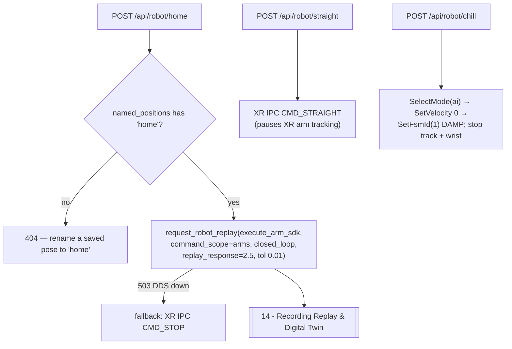

# 16 - Arm Control & Command Surfaces

> [!abstract] Goal
> Enumerate the **arm command surfaces** the server exposes and the machinery
> behind them: the guarded **right-wrist** control path (`/api/wrist/*`), the
> **posture presets** (`/api/robot/home`, `/api/robot/straight`,
> `/api/robot/chill`), the shared **`rt/arm_sdk` publisher** with its weight
> slot, the per-joint **limits and gains**, the **XR-suspend** hand-off, and the
> **forward kinematics** that give arm targets meaning. The heavy motion path —
> the closed-loop arm replay to a pose — lives in
> [[14 - Recording Replay & Digital Twin]]; this note is the surface map.

Sources: `server.py` (`command_wrist`, `stop_wrist`, `wrist_snapshot`,
`request_home`, `request_straight`, `request_chill` / `chill_motors`,
`_build_arm_sdk_cmd`, `_build_arm_sdk_trajectory_cmd`, `_build_lowcmd_wrist_cmd`,
`_suspend_xr_motion_publishers`, `named_positions`, `_tool_move`,
`ARM_SDK_JOINTS` / `ARM_SDK_KP` / `ARM_SDK_KD` / `ARM_SDK_WEIGHT_SLOT` /
`JOINT_LIMITS` / `WRIST_LIMITS`), `kinematics.py` (`ArmKinematics`,
`arm_pose_guide`), `docs/robot_control_paths.md`,
`docs/trajectory_executor_integration.md`, `docs/arm_sdk_replay_flow.drawio`.

## The three command surfaces

| Surface | Endpoint(s) | Underlying path | Guard | Moves |
| --- | --- | --- | --- | --- |
| **Right-wrist test** | `POST /api/wrist/command` · `/api/wrist/stop` · `/api/wrist/status` | `rt/arm_sdk` **or** `rt/lowcmd` (per `control_path`) | `armed=true` + `i_understand_risk=true` | Only `RightWristYaw` (motor 26) |
| **Posture presets** | `POST /api/robot/home` · `/straight` · `/chill` | home = arm_sdk replay; straight = XR IPC; chill = loco damp | See each below | Arms (home) / all motors (chill) |
| **Closed-loop arm replay** | `POST /api/recording/replay/robot` (`execute_arm_sdk`) | `rt/arm_sdk` cascade | Full gate stack → [[14 - Recording Replay & Digital Twin]] | Both arms + (planned) waist |

All three ultimately publish a 35-slot `unitree_hg/msg/LowCmd` on either
`rt/arm_sdk` or `rt/lowcmd`. See [[04 - HTTP API Reference]] for the consolidated
endpoint table and [[03 - Safety Interlocks]] for the guards.

## The `rt/arm_sdk` publisher (shared substrate)

The dashboard initializes an SDK2 Python publisher on **`rt/arm_sdk`**
(`docs/robot_control_paths.md` §Arm SDK Topic). Arm SDK commands reuse the
35-slot `LowCmd` shape but only fill the arm/waist joints and enable the
**arm-SDK weight slot at index 27**:

| Constant (`server.py`) | Value | Meaning |
| --- | --- | --- |
| `ARM_SDK_JOINTS` | `[13,14,15,16,17,18,19, 20,21,22,23,24,25,26, 12]` | left arm 13-19 + right arm 20-26 + waist yaw 12 (15 joints) |
| `ARM_SDK_WEIGHT_SLOT` | `27` | `motor_cmd[27].q` = **arm authority blend** (0..1) |
| `ARM_SDK_KP` | `[120,120,80,50,50,50,50, 120,120,80,50,50,50,50, 200]` | inner motor position gain per `ARM_SDK_JOINTS` entry |
| `ARM_SDK_KD` | `[2,2,1.5,1,1,1,1, 2,2,1.5,1,1,1,1, 2]` | inner motor damping gain |

Setting `motor_cmd[27].q = 1.0` blends arm control authority in **without** taking
over the legs or balance controller — every non-`ARM_SDK_JOINTS` slot stays zeroed
(`mode=0`). `_build_arm_sdk_cmd` (single target) and
`_build_arm_sdk_trajectory_cmd` (per-index targets + feed-forward torque) both copy
`mode_pr` / `mode_machine` from the live `rt/lowstate` and CRC-stamp every command
before `Write()`.

> [!warning] The waist cannot actually be driven through `rt/arm_sdk`
> Although waist yaw (joint 12) is in `ARM_SDK_JOINTS`, the H1-2 arm-SDK joint set
> `H1_2_JointArmIndex` is **13-26 only** (`server.py` comment, ~L362). So the
> closed-loop replay path explicitly **`.discard(WAIST_YAW_JOINT)`** from its
> target set, and torso twist is driven separately via `rt/lowcmd` commanding
> **only** joint 12 (`WAIST_LOWCMD_KP=200`, `WAIST_LOWCMD_KD=5`,
> `WAIST_LOWCMD_MAX_VEL_RAD_S=0.6`) with no motion-mode release. See
> [[24 - Control Gains, PID & Shared Mechanisms]].

## Joint & wrist limits

`JOINT_LIMITS` (radians, `server.py` ~L333) clamps every commanded arm/waist
target via `_clamp_joint_target`. Waist is intentionally conservative
(`(-1.2, 1.2)` vs a mechanical ±2.35).

| Idx | Joint | Limit (rad) | Idx | Joint | Limit (rad) |
| ---: | --- | --- | ---: | --- | --- |
| 12 | WaistYaw | -1.2 … 1.2 | 20 | RightShoulderPitch | -3.14 … 1.57 |
| 13 | LeftShoulderPitch | -3.14 … 1.57 | 21 | RightShoulderRoll | -3.4 … 0.38 |
| 14 | LeftShoulderRoll | -0.38 … 3.4 | 22 | RightShoulderYaw | -3.01 … 2.66 |
| 15 | LeftShoulderYaw | -2.66 … 3.01 | 23 | RightElbow | -0.95 … 3.18 |
| 16 | LeftElbow | -0.95 … 3.18 | 24 | RightWristRoll | -2.75 … 3.01 |
| 17 | LeftWristRoll | -3.01 … 2.75 | 25 | RightWristPitch | -0.4625 … 0.4625 |
| 18 | LeftWristPitch | -0.4625 … 0.4625 | 26 | RightWristYaw | -1.27 … 1.27 |
| 19 | LeftWristYaw | -1.27 … 1.27 | | | |

`WRIST_LIMITS = (-1.2, 1.2)` is a **tighter** operational clamp used only by the
right-wrist command surface (narrower than the joint's mechanical `(-1.27, 1.27)`).
The oscillate path clamps against **both** `WRIST_LIMITS` and `JOINT_LIMITS[26]`,
taking the intersection.

## Right-wrist control (`/api/wrist/command`)

`command_wrist(payload)` is the original arm command experiment — it drives **only**
`RIGHT_WRIST_YAW = 26`. It **requires `armed=true` + `i_understand_risk=true`**
(`has_risk_ack`); otherwise 400. A background daemon thread publishes at `rate` Hz
until `duration` elapses or the cancel event fires; a new command cancels the
previous one.

| Param | Range | Default | Notes |
| --- | --- | --- | --- |
| `mode` | `absolute` · `relative` · `oscillate` | `absolute` | `oscillate` **requires** `control_path=lowcmd` |
| `control_path` | `arm_sdk` · `lowcmd` | `arm_sdk` | picks publisher |
| `target_q` | `WRIST_LIMITS` (-1.2…1.2) | 0.0 | absolute target |
| `delta_q` | -0.25 … 0.25 | 0.0 | relative offset / oscillate amplitude |
| `kp` | 0 … 30 | 4.0 | position gain |
| `kd` | 0 … 5 | 0.35 | damping |
| `duration` | 0.05 … 12 s | 0.35 | run length |
| `rate` | 20 … 200 Hz | 80 | publish rate |
| `period` | 0.4 … 8 s | 2.0 | oscillate period |
| `auto_gains` | bool | — | overrides kp/kd via `_auto_wrist_gains` |

- **arm_sdk path**: `_build_arm_sdk_cmd(msg, target_q, kp, kd, weight=1.0)` each tick.
- **lowcmd path**: calls `motion_switcher.ReleaseMode()` first (releases onboard
  control of that joint), holds the other 26 body joints at their measured `q` via
  `_build_lowcmd_wrist_cmd`, then `SelectMode("ai")` to restore the controller on exit.
- **oscillate** builds `center_q + delta·sin(2π·elapsed/period)` around the
  **measured** center and clamps the final angle so the sinusoid can't push past
  the limits when the wrist starts near an extreme.

> [!note] Status & stop
> `GET /api/wrist/status` → `wrist_snapshot()` returns the `wrist_status`
> bookkeeping plus `joint` = `{index:26, name:"RightWristYaw", limits, telemetry}`.
> `POST /api/wrist/stop` → `stop_wrist()` signals the cancel event and, on the
> arm_sdk path, sends a final `weight=0.0` release. Historical context:
> `docs/robot_control_paths.md` notes isolated `rt/lowcmd` wrist control "vibrated
> and did not move meaningfully" — which is why the arm_sdk weight-slot path exists.

## Posture presets

### `/api/robot/home` — closed-loop move to the saved *home* pose

`request_home()` looks up `named_positions()["home"]` (a renamed saved recording;
see [[13 - Telemetry Recording & Pose Editor]]) and issues the **identical request
body** the dashboard Move button and chat `move` tool send:
`execute_arm_sdk=True, command_scope="arms", closed_loop=True,
hold_after_convergence=True, position_tolerance_rad=0.01, replay_response=2.5`. So
every arm_sdk safety gate applies unchanged. **404** if no pose is named `home`. If
the DDS path is unavailable (**503**), it falls back to the legacy XR teleop
`CMD_STOP` (arms drift home during clean shutdown).

### `/api/robot/straight` — XR IPC, *not* an arm_sdk path

> [!important] `straight` does not use `rt/arm_sdk`
> `request_straight()` is a thin `_request_xr_ipc("CMD_STRAIGHT", …)` call — it
> sends an IPC command to the XR teleop process and **pauses XR arm tracking**. It
> does not go through `plan_replay_control_path` / `execute_arm_sdk_replay`, so the
> arm_sdk validation gates do **not** apply to it. It returns **202** on success or
> 502/504 if the XR process rejects/times out. See
> [[11 - Teleoperation (Vision Pro & XR)]].

### `/api/robot/chill` — damp all motors (safety release)

`request_chill(payload)` is the arm/whole-body **release**. It cancels wrist
oscillation, then (ordered deliberately) `SelectMode("ai")` → `SetVelocity(0,0,0)`
→ `SetFsmId(1)` (damp), sleeping between so damp engages **before** any arm_sdk
hold is dropped — otherwise the onboard controller would snap the arms toward home
at full gains just before going limp. It then stops person-tracking and the wrist
loop (both re-assert arm authority otherwise). Requires the H1 loco client (**503**
if absent). `chill_motors()` = `request_chill({armed:True, i_understand_risk:True})`
and is the chat/MCP `chill_motors` tool ([[05 - Chat & MCP Tools]]). See
[[03 - Safety Interlocks]] and [[15 - Locomotion Control]].

## XR-suspend interplay

Before **any** arm_sdk replay publishes, `execute_arm_sdk_replay` calls
`_suspend_xr_motion_publishers()`. If the XR teleop motion publisher is still
alive it returns **409** ("arm_sdk replay would be overwritten"). The suspend
sequence (`server.py` ~L4190) runs `systemctl --user stop` + `kill --signal=KILL`
on `XR_MOTION_SERVICES`, then `pkill`/`pgrep` on `XR_TELEOP_PROCESS_PATTERN`, and
reports `remaining_processes`. `RTW_SKIP_XR_SUSPEND=1` (or missing `systemctl`)
skips it. This is the interlock that keeps two publishers off `rt/arm_sdk` at once.
See [[11 - Teleoperation (Vision Pro & XR)]].

## The `move` path (chat / MCP → arm_sdk replay)

The chat/MCP `move` tool (`_tool_move`, [[05 - Chat & MCP Tools]]) is a thin
wrapper over the same arm_sdk replay:

- `move {position:"home", confirm:true}` → `named_positions()["home"]` → replay.
- `move {position:"proposed", confirm:true}` → the pending LLM
  [[20 - LLM Arm Pose Proposals & Mimic|arm pose proposal]] is serialized to an
  ephemeral `.pose.json` snapshot (`command_scope="arms"`) and run through the
  **identical** validated pipeline. `confirm:true` is mandatory; a stale
  `proposal_id` is refused; proposals expire after `ARM_PROPOSAL_TTL_SECONDS=300`.

Both feed `request_robot_replay(execute_arm_sdk=True, …)` → the gate stack in
[[14 - Recording Replay & Digital Twin]].

## Kinematics behind arm targets

`kinematics.py` (`ArmKinematics`) parses the URDF and does **forward kinematics**
in the pelvis frame (`x=forward, y=left, z=up`, meters). It is used two ways:

1. **Pose-editor IK / preview** — the 3D viewer drags hand balls through
   `LEFT_ARM_IK_JOINTS` / `RIGHT_ARM_IK_JOINTS`; the wrist is kept **out** of the
   position IK chain and set directly (see [[13 - Telemetry Recording & Pose Editor]],
   [[17 - 3D URDF Viewer]]).
2. **LLM arm guide** — `arm_pose_guide()` probes each joint via FK to describe hand
   motion and emits **canonical anchor poses** for the LLM to interpolate from
   (right-arm angles; mirror Roll/Yaw sign for the left arm):

| Anchor | Right-arm joints |
| --- | --- |
| Hand at rest beside hip | all 0 |
| Hand straight forward at shoulder height | ShoulderPitch −1.57, Elbow 1.57 |
| Hands raised high (natural elbow bend) | ShoulderPitch −2.2, ShoulderRoll −0.35 |
| Arm straight up above head | ShoulderPitch −2.6, ShoulderRoll −0.35, Elbow 1.57 |
| T-pose (sideways straight, no bend) | ShoulderRoll −1.57, Elbow 1.57 |
| Arm crossed in front of chest | ShoulderPitch −1.6, ShoulderRoll 0.38, ShoulderYaw 1.5, Elbow 1.2 |

> [!note] Elbow convention
> `Elbow 0` = the natural ~90° bend (forearm points forward at the zero pose);
> `Elbow +1.57` = arm fully **straight**. Unspecified joints keep their current
> angle. See [[20 - LLM Arm Pose Proposals & Mimic]] and
> [[21 - Semantic Teleoperation Pipeline]].

> [!warning] Reference C++ example is a placeholder
> `docs/reference/h1_2_arm_sdk_dds_example.cpp` is present but **empty (0 bytes)** —
> it does not currently document the DDS message construction. The authoritative
> arm_sdk build lives in `server.py` (`_build_arm_sdk_cmd` /
> `_build_arm_sdk_trajectory_cmd`) and the flow diagram
> `docs/arm_sdk_replay_flow.drawio`.

## Safety posture

> [!warning] Only two arm paths actually move the robot today
> The **right-wrist** command and the **closed-loop arm_sdk replay** (incl. home /
> move) are the only surfaces that publish arm motor commands. Both require an
> explicit risk acknowledgement or the full replay gate stack, both suspend XR
> first, and neither uses `rt/lowcmd` for the arms (the `lowcmd` leg path is
> locked — see [[14 - Recording Replay & Digital Twin]]). `straight` is an XR IPC
> pause, and `chill` is a damp/release. See [[03 - Safety Interlocks]] and
> [[25 - Known Issues & Optimization Audit]].

## Related

[[14 - Recording Replay & Digital Twin]] · [[13 - Telemetry Recording & Pose Editor]] · [[24 - Control Gains, PID & Shared Mechanisms]] · [[20 - LLM Arm Pose Proposals & Mimic]] · [[21 - Semantic Teleoperation Pipeline]] · [[11 - Teleoperation (Vision Pro & XR)]] · [[15 - Locomotion Control]] · [[17 - 3D URDF Viewer]] · [[03 - Safety Interlocks]] · [[04 - HTTP API Reference]] · [[05 - Chat & MCP Tools]] · [[09 - Glossary]]
