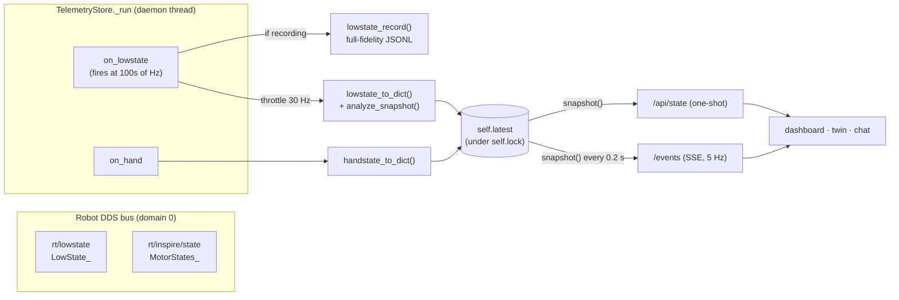

# 18 - Body, IMU, Battery & Hand Telemetry

> [!abstract] Goal
> Turn the H1-2's raw DDS `rt/lowstate` frames (and the Inspire hands'
> `rt/inspire/state`) into one **normalized snapshot dict** — per-motor rows,
> IMU attitude, robot mode, battery, foot force, and a derived
> **analysis/health** summary — then hand it to the dashboard through
> `/api/state` (one-shot) and `/events` (Server-Sent Events). This is the read
> side of the system: everything here is telemetry, not command. The recording
> path ([[13 - Telemetry Recording & Pose Editor]]) and digital-twin replay
> ([[14 - Recording Replay & Digital Twin]]) consume the same structures.

Sources: `server.py` — `TelemetryStore.__init__` / `_run` / `snapshot`,
`lowstate_to_dict`, `handstate_to_dict`, `motor_to_dict`, `hand_motor_to_dict`,
`summarize_motors` / `summarize_motor_groups` / `summarize_imu`, `health_flags`,
`analyze_snapshot`, `lowstate_record`, `_send_events`; the constants
`JOINT_NAMES`, `JOINT_GROUPS`, `HAND_JOINT_NAMES`, `HAND_STATE_TOPIC`.

## DDS subscription pipeline

`TelemetryStore.start()` spawns one daemon thread (`unitree-lowstate`) running
`_run`, which imports the Unitree SDK, calls
`ChannelFactoryInitialize(self.domain, camera_source or None)`, and opens two
subscribers (`server.py` `_run`, ~L6847):

| Topic | IDL type | Callback | Queue depth |
| --- | --- | --- | --- |
| `rt/lowstate` | `LowState_` (`unitree_hg`) | `on_lowstate` | 10 |
| `rt/inspire/state` (`HAND_STATE_TOPIC`) | `MotorStates_` (`unitree_go`) | `on_hand` | 10 |

The **DDS domain** comes from the `--domain` CLI arg (default `0`,
`server.py` main) and is passed to `TelemetryStore(domain=...)`. If the SDK
import or DDS init fails, `_set_error(...)` records the reason and the thread
exits — `snapshot()` keeps returning `connected: False` with that error string.

### Callback throttling — the rebuild vs. stream cadence

`on_lowstate` fires **hundreds of times per second**, so it does the minimum
per call (`server.py` ~L6780):

1. Bump `self.samples` and append `now` to `self.sample_times` (a
   `deque(maxlen=300)`).
2. **Only if a recording is open** (`self.recorder.file is not None`) build the
   full per-sample record and `write_sample(...)` — otherwise skip it entirely.
3. **Throttle the snapshot rebuild to 30 Hz**: `if now - last_snapshot_at < 1.0/30.0: return`. Past that gate it recomputes the sample rate, builds
   `lowstate_to_dict(...)`, and swaps `self.latest` under `self.lock`.

`on_hand` is lighter: it stores the latest hand message and refreshes
`self.latest["hands"]` on each hand frame (and the `_run` loop also refreshes it
every 0.25 s as a fallback).

> [!note] Sample rate is measured, not assumed
> `sample_rate_hz` is computed from the timestamp deque:
> `rate = (len(sample_times) - 1) / (sample_times[-1] - sample_times[0])`,
> rounded to 2 dp. It reflects the **true `rt/lowstate` arrival rate** (typically
> hundreds of Hz on H1-2), independent of the 30 Hz rebuild and 5 Hz stream.

The header's `#rate` bubble that displays this value has a fixed 136 px
footprint (`styles.css`, `#rate` rule, 2026-07-27) with centered text and
`tabular-nums`, so the pill no longer stretches/shrinks as the digit count
changes between updates.

## The normalized snapshot (`lowstate_to_dict`)

`lowstate_to_dict(msg, samples, rate_hz, hands)` produces the dict that becomes
`self.latest`. Top-level keys (`server.py` ~L2175):

| Key | Contents |
| --- | --- |
| `connected` | `True` once a LowState frame has been decoded |
| `timestamp` | wall-clock `time.time()` of the rebuild |
| `samples` | cumulative `rt/lowstate` frame count |
| `sample_rate_hz` | measured arrival rate (see above) |
| `motor_count` | length of the motor list |
| `motors` | per-motor rows — see below |
| `imu` | raw IMU fields — see below |
| `robot` | robot mode fields — see below |
| `hands` | latest `rt/inspire/state` block (`handstate_to_dict`) |
| `battery` | BMS block **or** a "not exposed" marker — see below |
| `foot_force` / `foot_force_est` | present only if the message carries them |
| `analysis` | derived motor / IMU / health summary — see below |

`TelemetryStore.snapshot()` wraps `self.latest` and adds `network` (cached),
`loco` status, and `arm_proposal` before serving. It is the exact payload for
`/api/state` and each `/events` tick.

### Per-motor rows (`motors`)

`motor_to_dict(index, motor)` copies these fields off each `motor_state` slot,
then adds `index` and `name` (`server.py` ~L1978):

`mode`, `q`, `dq`, `ddq`, `tau_est`, `temperature`, `vol`, `sensor`, `reserve`.

- `name` = `JOINT_NAMES[index]`, or `ReservedMotorSlot{index}` for slots the H1-2
  does not populate. `JOINT_NAMES` covers indexes **0–26**:

| Range | Group (`JOINT_GROUPS`) | Joints |
| --- | --- | --- |
| 0–5 | `left_leg` | HipYaw, HipPitch, HipRoll, Knee, AnklePitch, AnkleRoll |
| 6–11 | `right_leg` | (mirror of left leg) |
| 12 | `waist` | WaistYaw |
| 13–19 | `left_arm` | ShoulderPitch/Roll/Yaw, Elbow, WristRoll/Pitch/Yaw |
| 20–26 | `right_arm` | (mirror of left arm) |
| 27–34 | `reserved` | unnamed slots → `ReservedMotorSlot{index}` |

- `temperature` is a **list** (multi-sensor per motor); helpers take the max of
  the positive readings (`motor_temperature`, ~L2050).

> [!note] Live rows omit `tau`; recordings keep it
> The **live snapshot** motor row has `tau_est` but **not** raw `tau`
> (`motor_to_dict`). The full-fidelity **recording** row
> (`compact_record_motor`, ~L1808) keeps both `tau` and `tau_est`. Hand rows
> (below) carry both in the live snapshot as well. This is part of the snapshot
> trimming (next section).

### IMU (`imu`)

`fields_from(msg.imu_state, [...])` copies `quaternion`, `gyroscope`,
`accelerometer`, `rpy`, `temperature` verbatim. The **analysis** layer derives a
human-readable attitude from `rpy` (radians) via `summarize_imu` (~L2117):
`roll_deg`, `pitch_deg`, `yaw_deg` (converted with `math.degrees`, rounded 2 dp)
plus the raw `temperature`.

### Robot mode (`robot`)

The live snapshot keeps a **trimmed** set of mode fields (`server.py` ~L2192):
`version`, `mode_pr`, `mode_machine`, `tick`, `crc`. The ~40-byte
`wireless_remote` RC array is **deliberately omitted** from the live snapshot
(no client reads it; the server decodes RC combos from the raw DDS message) but
is retained in the recording path.

### Battery (`battery`) — usually "not exposed"

Battery handling is conditional on the firmware exposing `bms_state`
(`server.py` ~L2208):

- **If `msg.bms_state` exists:** `battery = {soc, current, cycle, temperature}`.
- **Otherwise:** `battery = {"state": "not exposed by this LowState firmware", "checked_fields": ["bms_state", "battery_state", "power_v", "power_a"]}`.

> [!warning] Battery is typically absent on this H1-2
> On the observed H1-2 firmware, `rt/lowstate` does **not** carry a BMS block, so
> the snapshot serves the **"not exposed"** marker and `health_flags` raises the
> info flag *"Battery details are not exposed by this LowState firmware."* Do not
> assume SoC/current are available — treat battery as best-effort. Whether a
> given firmware build populates `bms_state` is not verifiable from this repo.

### Foot force

`foot_force` and `foot_force_est` are added (via `listify`) **only if** the
message object has those attributes; on firmware that omits them the keys are
simply absent from the snapshot.

## Analysis & health summary (`analysis`)

`analyze_snapshot` attaches an `analysis` block with three parts
(`server.py` ~L2161):

**`analysis.motors`** (`summarize_motors`): splits real vs. reserved slots and
reports `real_count`, `reserved_count`, `mode_counts` (mode → count over real
motors), `moving_count`, `hottest`, `max_abs_tau`, `max_abs_velocity`, and a
`groups` breakdown.

| Derived value | Rule |
| --- | --- |
| **moving** (`moving_count`, per-group `moving`) | `abs(dq) > 0.05` |
| **hottest** | real motor with the highest `motor_temperature` (max positive temp reading) |
| **max_abs_tau** | real motor with the largest `abs(tau_est)` |
| **max_abs_velocity** | real motor with the largest `abs(dq)` |
| **groups[g]** | `{count, moving, max_temperature}` over each `JOINT_GROUPS` group |

**`analysis.imu`** (`summarize_imu`): the roll/pitch/yaw-in-degrees + temperature
described above.

**`analysis.health`** (`health_flags`): a `state` of `"warning"` (if any flag is
warning-level) or `"ok"`, plus a `flags` list:

| Condition | Level | Message gist |
| --- | --- | --- |
| `connected` is false | `critical` | No LowState telemetry received |
| all real motors report `mode 0` | `info` | Robot passive / idle |
| hottest motor `≥ 70 °C` | `warning` | Hottest motor is `<name>` at `N` C |
| IMU temperature `≥ 75 °C` | `warning` | IMU temperature is `N` C |
| hands not connected | `info` | Hand telemetry offline on `rt/inspire/state` |
| battery marker present | `info` | Battery details not exposed by firmware |

This summary is what the chat/[[05 - Chat & MCP Tools|LLM]] read-only tools and
the dashboard health strip surface, and what the "full information flow" text
renderer (`server.py` ~L1355) folds into the model prompt.

## RH56BFX / Inspire hand telemetry

The H1-2's dexterous hands are Inspire **RH56BFX** units. Their state arrives on
`rt/inspire/state` as a `MotorStates_` message and is normalized by
`handstate_to_dict` (`server.py` ~L2019):

- **Connected:** `{connected: True, topic: "rt/inspire/state", samples, timestamp, joint_count, joints: [...]}`.
- **Not connected** (no message yet): `{connected: False, ..., joints: [], note: "No hand state received. Start inspire_h1 service if the RH56BFX hands are connected over serial."}`.

Each hand joint row (`hand_motor_to_dict`, ~L1998) carries `mode`, `q`, `dq`,
`ddq`, **`tau`**, `tau_est`, `temperature`, `vol`, `sensor`, `reserve`, plus
`index` and `name`. Names come from `HAND_JOINT_NAMES` — **12 joints, 6 per
hand** (right first, then left):

| Index | Name | Index | Name |
| --- | --- | --- | --- |
| 0 | RightPinky | 6 | LeftPinky |
| 1 | RightRing | 7 | LeftRing |
| 2 | RightMiddle | 8 | LeftMiddle |
| 3 | RightIndex | 9 | LeftIndex |
| 4 | RightThumbBend | 10 | LeftThumbBend |
| 5 | RightThumbRotation | 11 | LeftThumbRotation |

> [!note] Hands are a separate service and a separate topic
> Hand telemetry is independent of `rt/lowstate` — the RH56BFX hands stream over
> their own serial-backed `inspire_h1` service publishing `rt/inspire/state`. If
> that service is down the body telemetry is still fully live; only the `hands`
> block reports `connected: False`. Finger **commands** ride `rt/inspire/cmd`
> (`HAND_COMMAND_TOPIC`) — see [[16 - Arm Control & Command Surfaces]].

## Snapshot trimming (the 5 Hz optimization)

`snapshot()` is called **per SSE tick per client** (and on every `/api/state`
GET), so the live snapshot is deliberately smaller than the recording record
(`server.py` comments ~L2194, ~L2209):

- **Omitted from the live snapshot** (no client reads them): `wireless_remote`
  from `robot`; and `version_h` / `version_l` / `bms_status` from `battery`; and
  raw `tau` from body motor rows.
- **Kept in the recording path** (`lowstate_record`, `compact_record_motor`):
  the full set, including `wireless_remote`, the extra BMS fields, and raw `tau`
  — the recordings are meant to be full-fidelity for offline analysis.
- Network status is cached (`cached_network_status`, `NETWORK_STATUS_TTL_SECONDS`)
  because `snapshot()` runs at 5 Hz and `network_status` forks a subprocess and
  opens a socket — too costly to run per tick.

## Serving: `/api/state` and `/events`

| Path | Method | Behavior |
| --- | --- | --- |
| `/api/state` | GET | One `store.snapshot()`, sent as JSON (`server.py` ~L6916) |
| `/events` | GET | SSE stream: `data: <snapshot JSON>\n\n` on a loop |

`_send_events` (`server.py` ~L7314) sends `Content-Type: text/event-stream`,
then loops: serialize `store.snapshot()` (compact separators), write one SSE
`data:` frame, flush, `time.sleep(0.2)`. That is a **5 Hz** push (~200 ms
between frames); a dropped/half-open client raises `OSError` and cleanly ends
the loop.

> [!warning] Stream cadence is 5 Hz (~200 ms), not ~100 ms
> The `/events` loop sleeps `0.2 s`, i.e. **~5 frames/second (~200 ms apart)** —
> matching the `snapshot()` "runs per SSE tick (5 Hz)" comment. There is no
> ~100 ms (10 Hz) push path in the current code; a `~100 ms` cadence claim is
> **not** supported by `server.py`. (The internal snapshot *rebuild* is the
> faster stage at 30 Hz; the *stream* to clients is 5 Hz.)

## Related

[[13 - Telemetry Recording & Pose Editor]] · [[14 - Recording Replay & Digital Twin]] · [[16 - Arm Control & Command Surfaces]] · [[04 - HTTP API Reference]] · [[01 - Architecture]] · [[03 - Safety Interlocks]] · [[24 - Control Gains, PID & Shared Mechanisms]] · [[05 - Chat & MCP Tools]] · [[09 - Glossary]] · [[00 - Project Overview]]
