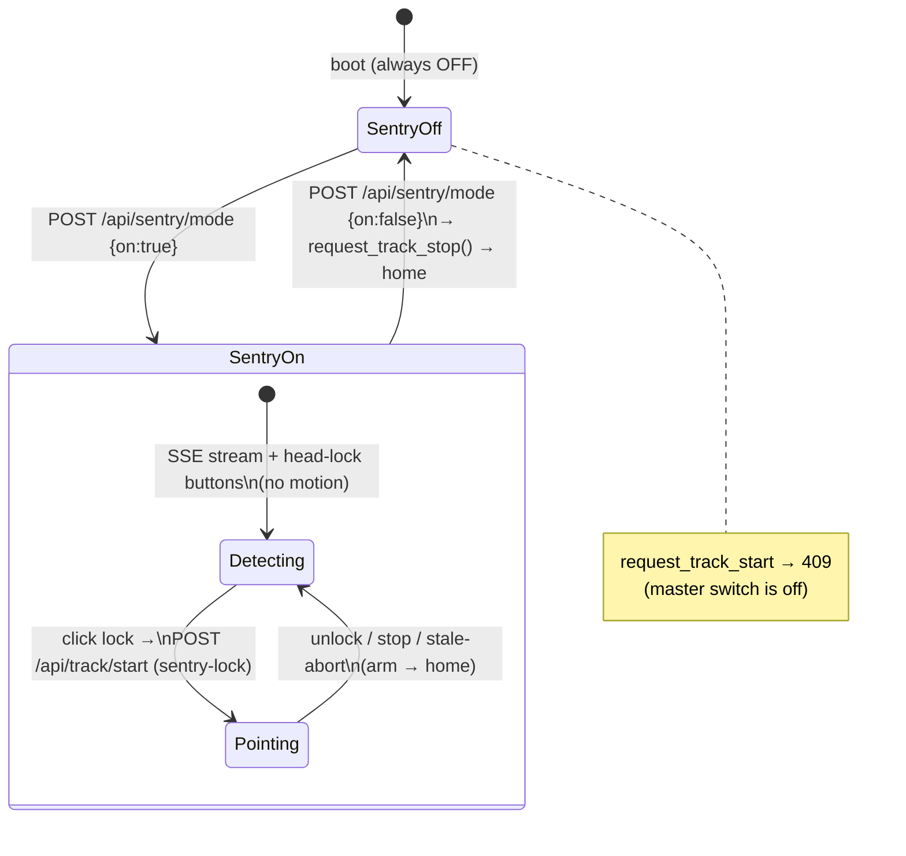

# 19 - Sentry Mode & Head-Lock

> [!info] Renamed to **Bullseye Mode** (2026-07-27)
> All user-facing text (toggle tooltip/aria-label, `Bullseye: N` webcam
> counter, server error/status messages) now says **Bullseye Mode**, and the
> topbar toggle got a segmented-crosshair bullseye icon. **Internal names are
> unchanged**: the `/api/sentry/*` endpoints, `sentry_*`/`SENTRY_*`
> identifiers, DOM ids (`sentryToggle`, `floatCamSentry`), CSS classes
> (`.sentry-toggle`) and the `h1_sentry_boxes` localStorage key all keep
> `sentry`, so robot-side services and env-var overrides are unaffected.
> Everywhere this note says "Sentry", read "Bullseye" for the UI.
>
> The same commit added a **Mimic Mode** button (`#mimicModeToggle`, person
> icon with raised hands) next to the Bullseye toggle in the topbar. It is a
> **placeholder only** — styled via `.mimic-mode-toggle`, wired to nothing yet.
> It is unrelated to the existing chat "mimic this pose" image-attach flow.

> [!abstract] Goal
> Give the operator one deliberate, server-owned arming control for
> person-following. **Sentry Mode ON** turns on live person detection on the
> floating camera and draws a glowing **lock button** over each person's head;
> clicking one **locks** that person and — in the final phase — starts a
> guarded **closed-loop arm-pointing** session at them. **Sentry Mode OFF** is
> the kill switch: it stops any running tracking session and forbids a new one
> from starting. The Sentry toggle *is* the tracking master switch.

Sources: `server.py` (`sentry_detect`, `_sentry_stream_worker` /
`sentry_stream_subscribe` / `wait_sentry_result`, `set_sentry_mode`,
`request_track_start` / `_run_tracking`, `parse_track_payload`, the
`SENTRY_*` constants, `_send_sentry_stream`), `tracking.py` (the pointing
math — see [[06 - Person Tracking (CV Feature)]]), `static/app.js`
(`setupSentry` module), and the four design/plan docs under
`docs/superpowers/` dated 2026-07-22 (cited inline).

## The three phases (roadmap)

Person interaction was built in three phases (spec
`2026-07-22-sentry-mode-person-detection-design.md`); all three are now live:

| Phase | Design/plan doc | What it added | Robot motion? |
| --- | --- | --- | --- |
| **1 — passive overlay** | `…sentry-mode-person-detection-design.md` · `…plans/…sentry-mode-phase1.md` | `GET /api/sentry/detect` — forward one cached JPEG to the YOLO service, return normalized person boxes; a "Sentry Mode" toggle gates the browser polling | **None** |
| **2 — head-lock buttons** | `…sentry-head-lock-buttons-design.md` · `…plans/…sentry-head-lock-buttons.md` | Boxes replaced by a **glowing lock button** hovering over each head; click locks one person; pure UI state | **None** |
| **3 — pointing** | `…sentry-pointing-phase3-design.md` | The lock click starts a **permanent, closed-loop** guarded `/api/track/*` arm-pointing session at the locked person | **Yes (arm)** |

> [!note] The implementation moved past the Phase-1 spec
> The specs proposed a *stateless* design (no server-side loop; the browser
> polls only while boxes are visible). The shipped code went further on both
> ends: Sentry is now a **server-owned arming flag** (`store.sentry_mode_on`)
> reached through `POST /api/sentry/mode`, and detection is a **shared
> Server-Sent-Events push stream** (`/api/sentry/stream`) fed by one
> background worker instead of per-client polling. Where the code and the
> older specs disagree, the code below is authoritative.

## The invariant — Sentry toggle = the tracking master switch

This is the load-bearing rule (`server.py` L2667–2671, operator decision
2026-07-22):

- `store.sentry_mode_on` **defaults OFF on every boot** — following must always
  be re-armed deliberately, never survives a restart.
- `request_track_start` refuses with **HTTP 409** when Sentry is off:
  *"Sentry mode is off — it is the master switch; turn it on before starting
  tracking."* (L5372–5375). No tracking session can begin while the flag is
  off, regardless of risk-ack.
- `set_sentry_mode({"on": false})` **calls `request_track_stop()`** (L5338–5339):
  turning Sentry off immediately cancels any running session and, on session
  end, the arm is returned to the saved **home** pose (`request_home`,
  L5604–5612).



## Server state & the `/api/sentry/*` surface

Sentry state lives on `TelemetryStore` (`server.py` L2655–2671):

| Field | Purpose |
| --- | --- |
| `sentry_mode_on` | The master arming flag (default `False`). Read under `command_lock`. |
| `sentry_stream_lock` / `_condition` | Guard + wakeup for the shared detect stream. |
| `sentry_stream_clients` | Ref-count of live SSE subscribers; the worker exits when it hits 0. |
| `sentry_stream_latest` / `_seq` | Last detection result + a monotonically-increasing sequence number subscribers block on. |
| `sentry_stream_worker_running` | Explicit run-state (not `thread.is_alive()`) so worker-exit and subscribe-start are mutually exclusive under the lock — avoids a stall in the worker's dying window. |

| Endpoint | Method | Behavior |
| --- | --- | --- |
| `/api/sentry/detect?feed=head\|webcam` | GET | One synchronous detection: take the cached JPEG for the feed (`get_camera_frame()` for `head`, `webcam_frame` for `webcam`), shrink it (`shrink_jpeg_for_detection`), POST to `TRACKING_DETECT_URL` with `feed=` appended and a **0.5 s** timeout, return `{ok, feed, persons:[…], ts}`. Unknown feed / no frame / upstream down → `{ok:false, error}` (all HTTP 200). |
| `/api/sentry/stream` | GET (SSE) | `text/event-stream`; subscribes to the shared worker and pushes each new `sentry_detect("webcam")` result as `data: {…}`; sends `: ping` keepalive comments when detection is stalled; unsubscribes on disconnect. |
| `/api/sentry/mode` | POST | `set_sentry_mode({"on": bool})`. Non-bool body → 400. Turning off calls `request_track_stop()`. Returns `{ok, sentry_mode, tracking: track_snapshot()}`. |

See the consolidated table in [[04 - HTTP API Reference]]. Note that
`/api/sentry/mode` is registered in the POST allow-list and JSON-body list
(`server.py` L7025, L7057); the two GET routes dispatch in `do_GET`.

## The shared detect-stream worker

Instead of every browser polling `/api/sentry/detect`, the server runs **one**
background loop shared by all SSE subscribers (`_sentry_stream_worker`,
L5298–5317):

- `sentry_stream_subscribe()` increments the client count and **lazily starts**
  the `sentry-stream` thread if none is running.
- The worker loops at `SENTRY_STREAM_HZ` (default **15 Hz**, env-clamped 1–30),
  calling `sentry_detect("webcam")` each tick and bumping `sentry_stream_seq`.
  The real rate is capped by the AI-host roundtrip — the loop never overlaps
  requests.
- **It exits the instant `sentry_stream_clients <= 0`.** Closing the last
  browser stream stops all detection traffic — the same "UI-gated load"
  guarantee the Phase-1 spec wanted, achieved server-side.
- The `finally` block clears `sentry_stream_worker_running` on **every** exit
  (normal or exception) so a later subscribe always starts a fresh worker,
  even if `sentry_detect` threw.
- `wait_sentry_result(last_seq, timeout)` lets a subscriber block on the
  condition until a newer sequence lands (or timeout → `None`, which the SSE
  handler turns into a keepalive ping).

The physical tracking loop for a **webcam** session is *also* a subscriber
(L5505–5509, L5520–5523): it reuses the same shared stream rather than opening
its own detection roundtrip, and unsubscribes in its `finally`.

## Head-lock buttons (frontend `setupSentry`)

`static/app.js` `setupSentry` (L3368+) owns the UI. Key departures from the
Phase-2 plan (which used `localStorage`) — **the server owns the arming flag**:

- The toggle click flips `serverOn` by POSTing `/api/sentry/mode`; the UI never
  trusts local state — `syncMode()` re-reads `/api/track/status` every 2 s and
  `applyServerFlag(status.sentry_mode)` keeps the button in sync (L3496–3517).
- Detections arrive over the **SSE stream** (`EventSource("/api/sentry/stream")`,
  L3782); the 250 ms interval is only a *gate check* — it opens the stream when
  Sentry is on **and** the floating cam + webcam `` are visible, and closes
  it (stopping all detection) otherwise (L3792–3797).
- Client-side tracks: greedy nearest-center association (fallback gate
  `MATCH_DIST = 0.18`) keyed on the detector's **persistent track id**
  (`serviceId`, per-feed ByteTrack/BoT-SORT state on the detection service),
  light smoothing (`SMOOTH_ALPHA = 0.75`), TTL 1 s, plus a **60 fps rAF spring**
  that glides each button toward its target pixel between SSE updates.
- One `<button class="target-lock-btn">` per track, positioned over the head
  (top-center of the smoothed box, cover-transform mapped). Glyph 🔒; unlocked =
  red pulsing glow (`title="Bu kişiye kitlen"`), locked = green glow
  (`title="Kilidi kaldır"`).

### Lock semantics

- **One lock at a time.** Click unlocked → lock & start pointing; click the
  locked one → unlock & stop; click another → switch (stop, then start with the
  new seed).
- **Pending re-lock:** when the locked person leaves frame, their `serviceId` is
  remembered for `PENDING_LOCK_MS` (12 s); if BoT-SORT re-identifies them on
  re-entry the lock re-attaches without a new click. The counter shows
  ` • RE-LOCK…` meanwhile.
- **Auto-unlock** when the track ages out, the floating cam closes, or Sentry is
  toggled off (`pushMode(false)` clears `lockedId`/`pendingLock` and stops
  pointing).
- Header counter: `Sentry: N`, appending ` • LOCKED` (UI lock, no motion),
  ` • POINTING` (server confirms an active session), or ` • RE-LOCK…`.

> [!note] Optional boxes
> A separate `sentryBoxesToggle` (`localStorage h1_sentry_boxes`) can re-enable
> the Phase-1 bounding-box drawing on the `floatWebcamOverlay` canvas alongside
> the lock buttons. Off by default.

## Phase 3 — lock → closed-loop pointing

Clicking a lock (`startPointing`, app.js L3441) fires the guarded start:

```
POST /api/track/start
{armed:true, i_understand_risk:true, source:"sentry-lock",
 camera:"webcam", permanent:true, closed_loop:true,
 target:{cx,cy}, target_id:<serviceId>}
```

`request_track_start` (L5363) validates via `parse_track_payload` then runs the
full interlock gauntlet — Sentry must be on, plus everything below. The
`_run_tracking` loop (L5427) then drives the **right arm** through the same
closed-loop PID + gravity feed-forward corrector as the arm replay
(`_closed_loop_arm_targets` + `_build_arm_sdk_trajectory_cmd`, `weight=1.0`).

Webcam/Sentry sessions use their own tuning, from the `SENTRY_*` env constants
(`server.py` L509–528):

| Constant | Default | Meaning |
| --- | --- | --- |
| `SENTRY_STREAM_HZ` | 15 | Target rate of the shared detect loop (clamp 1–30). |
| `SENTRY_FOV_YAW` | 1.25 | Horizontal FOV mapping. The deployed USB cam already reads robot-relative L/R (verified 2026-07-23), so it is **not** mirrored. |
| `SENTRY_FOV_PITCH` | 0.9 | Vertical FOV mapping. |
| `SENTRY_YAW_OFFSET` / `SENTRY_PITCH_OFFSET` | 0.11 / -1.52 | Center-pose aim offsets. |
| `SENTRY_REPLAY_RESPONSE` | 1.25 | Corrector response — quicker than general replay, below the legacy ceiling (clamp ≤2.5). |
| `SENTRY_MAX_STEP_RAD_S` | 0.65 | Per-tick velocity bound applied before every publish (clamp 0.1–1.0). |
| `SENTRY_AIM_ALPHA` | 0.25 | EMA alpha of the image-space `AimSmoother` (webcam path; head cam is fixed at 0.25). Higher = less lag. Clamp 0.05–1.0. |
| `SENTRY_SMOOTH_ALPHA` | 0.35 | EMA alpha of the joint-space `Smoother` (webcam path; head cam is fixed at 0.35). Clamp 0.05–1.0. |

> [!note] 2026-07-27 "snappier" retune reverted the same day
> A retune raised the defaults to response 2.0 / step 0.9 / alphas 0.5 & 0.6
> for faster target-following, but the operator found the motion too
> aggressive and the defaults went back to the original conservative values
> above. The env-var knobs (and the `SENTRY_AIM_ALPHA` / `SENTRY_SMOOTH_ALPHA`
> overrides the retune introduced) remain, so the snappy profile can still be
> selected per-deployment without a code change. The `RateLimiter` bounds every
> published step regardless (test-pinned envelope in
> `tests/test_tracking_endpoints.py::test_sentry_response_is_faster_but_still_bounded`).

Two Sentry-specific behaviors worth naming:

- **Permanent sessions** (`permanent:true`) bypass the `TRACKING_MAX_SESSION_S`
  ceiling (L5515) — a Sentry lock holds indefinitely until unlock / Sentry-off /
  cam-close / operator stop / stale-abort.
- **Constant hand height:** because horizontal pose interpolation moves
  elbow/roll (not just yaw), a fixed image-Y alone can't keep the hand level.
  The loop pins the right hand to the calibrated center pose's FK Z
  (`sentry_right_hand_z`) and re-solves shoulder pitch each tick
  (`sentry_constant_hand_z_goal` / `_step`, L545–589) — inside the velocity
  bound, so it never bypasses the rate limiter.

The pointing/aiming math itself (image→joint mapping, dead-band, staleness
state machine, neutral-park) lives in `tracking.py` and is documented in
[[06 - Person Tracking (CV Feature)]] — not repeated here. Target **seeding**:
when the payload carries `target`, `_run_tracking` pre-sets `state.target` to a
synthetic box at that cx/cy so the first association latches the clicked person,
not the largest one (L5462–5481).

## Interlocks that still apply (Phase 3)

Sentry arming is deliberately motion-free; the lock click is treated as the
operator's arming action, which **weakens only the risk-ack dialog** — every
other interlock stays intact (spec §Operator decisions; `server.py`
L5363–5425). See [[03 - Safety Interlocks]].

| Guard | Where | Effect |
| --- | --- | --- |
| Risk-ack | `has_risk_ack(payload)` | 403 without `armed`+`i_understand_risk`. |
| **Sentry master switch** | `sentry_mode_on` | 409 when off. |
| `TRACKING_ENABLED` kill switch | env, default 0 | 409 when disabled. |
| Sentry-lock shape | source check | 400 unless `camera=webcam` + `target` present. |
| One session at a time | `track_thread` | 409 if a session is already running. |
| DDS readiness | publisher / lowstate / factory | 503 if any is missing. |
| Replay conflict | `replay_thread` | A sentry-lock may cancel a running **home** replay; other sources 409. |
| XR suspension | `_suspend_xr_motion_publishers()` | 503 if XR publishers can't be suspended. |
| Staleness → neutral | `TrackState` (tracking.py) | Lost target ≥1.5 s parks the arm at `NEUTRAL_TEMPLATE`; 10 consecutive detect failures abort. |
| JOINT_LIMITS re-clamp | `_build_arm_sdk_trajectory_cmd` | Server re-clamps against real limits regardless of `TRACK_LIMITS`. |

## Restart gotchas

> [!warning] Sentry always boots OFF — re-arm after every restart
> `sentry_mode_on` is not persisted; a server restart (the robot's
> `robot-telemetry-web-autoupdate` timer pulls `origin/main` and restarts the
> service) drops Sentry to OFF and kills any session. After any restart the
> operator must re-toggle Sentry on and re-click the lock. The `SENTRY_*`
> calibration constants come from `Environment=` in
> `robot-telemetry-web.service` — a restart is required between tweaks (spec
> §Bring-up). See [[22 - Deployment & Runtime Services]].

> [!warning] Unverified on real hardware
> Per the project memory, robot deploys have been **frozen since 2026-07-23**
> and the supervised on-arm bring-up (yaw-sign check, stop-path verification,
> stale→neutral timing) described in the Phase-3 spec §Bring-up was still
> pending at the time of writing. The FOV/offset defaults and the "USB cam is
> not mirrored" note are calibration *starting points*, not field-confirmed for
> the current mount. Confirm live before trusting the aim direction.

## Relationship to Detection & Tracking

- [[07 - Detection Service (YOLO)]] is the CV backend: `sentry_detect` forwards
  the JPEG to `TRACKING_DETECT_URL` (default `http://10.2.125.3:8188/detect`)
  and passes `feed=` so the service keeps a **per-feed** persistent-id tracker
  (ByteTrack/BoT-SORT). Those ids are what the head-lock buttons and pending
  re-lock key on.
- [[06 - Person Tracking (CV Feature)]] owns the pure decision math in
  `tracking.py` (`PointingMapper`, `AimSmoother`, `RateLimiter`, `Smoother`,
  `associate`, `TrackState`). Sentry supplies the frames, the master switch,
  and the webcam-specific tuning/constant-Z wrapper; the math is unchanged.
- [[12 - Camera & Video Streaming]] supplies the head and webcam JPEG caches
  Sentry reads. [[16 - Arm Control & Command Surfaces]] owns the arm_sdk
  publish path the pointing session drives.

## Related

[[06 - Person Tracking (CV Feature)]] · [[07 - Detection Service (YOLO)]] · [[03 - Safety Interlocks]] · [[04 - HTTP API Reference]] · [[12 - Camera & Video Streaming]] · [[16 - Arm Control & Command Surfaces]] · [[22 - Deployment & Runtime Services]] · [[24 - Control Gains, PID & Shared Mechanisms]] · [[05 - Chat & MCP Tools]] · [[09 - Glossary]]
</content>
</invoke>
