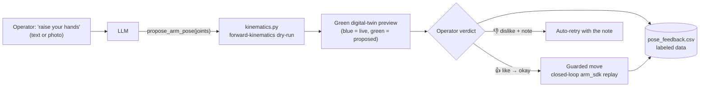

# 20 - LLM Arm Pose Proposals & Mimic

> [!abstract] Goal
> Let the operator ask for an arm pose in natural language ("raise your hands",
> "reach forward") **or by attaching a photo**, and have the LLM *propose* joint
> angles that are previewed on a green digital twin before anything moves. The
> operator approves (👍) or rejects (👎 + note); only an approved pose runs, and
> only through the existing guarded closed-loop arm replay. Every verdict is
> logged as labeled learning data.

Sources: `server.py` (`propose_tool_spec`, `propose_arm_pose` handler,
`parse_twin_evidence`, `parse_mimic_image`, `pose_feedback_dataset`,
`_append_pose_feedback_row`, `chat()` backend routing), `kinematics.py` (forward
kinematics + canonical anchors), `static/app.js` (pose-feedback card, mimic
attach), `static/feedback.html` (plot page), `tools/claude_bridge.py` (vision).

## The proposal loop

1. The operator asks for a pose. The LLM answers with a **`propose_arm_pose`**
   tool call carrying a `joints` map (H1-2 joint name → radians) and a natural
   `semantic_pose` description.
2. `kinematics.py` runs **forward kinematics** on those angles (a dry-run — no
   motion) so the resulting hand positions can be shown.
3. The dashboard renders the proposal as a **green ghost** next to the **blue**
   live model. Nothing has moved on the real robot.
4. The operator rates it 👍/👎 (see feedback below). On approval the staged
   pose executes via the same **guarded closed-loop arm replay** as the `move`
   tool — see [[03 - Safety Interlocks]] and [[13 - Telemetry Recording & Pose Editor]].

> [!important] The preview is not a motion
> A `propose_arm_pose` call **stages** a pose; it never publishes a motor
> command. The arm only moves after an explicit approval drives the guarded
> `move` path. This approve-gate is the safety net for LLM guesswork.

## Canonical anchors (prompt hardening)

Early on, qwen would parrot the single prompt example (e.g. proposing the
"forward" example pose for "raise both hands"). `kinematics.py` now ships
**FK-verified canonical anchors** — up / forward / T-pose / crossed, with
mirrored both-arm variants — plus a SIDE RULE (robot's own frame) and
straight-arm anchors (`Elbow +1.57` = straight). The LLM is told to prefer an
anchor when the request clearly matches one. The 7-DOF-per-arm target is
shoulder pitch/roll/yaw, elbow, wrist yaw/roll/pitch.

## Pose feedback (labeled learning data)

Before executing, the operator answers **liked or disliked** with two thumb
buttons; even on approval a negative note can be attached, and a 👎 can request a
change (auto-retry with the note). Every event is appended to a CSV:

- Live file: `feedback/pose_feedback.csv` (untracked, on the robot).
- Auto-synced to the tracked repo copy `data/pose_feedback.csv` via a deploy key.
- Columns: `timestamp_iso, proposal_id, event(liked|disliked|executed),
  request_text, joints_json, semantics_json, comment, image_path, parent_id`.
- **Correction chains:** a 👎 retry sends `retry_of`, so the corrected proposal
  records `parent_id` — the chain (original → corrections) is explicit in the
  data. A retry without its own attachment inherits the parent's reference
  image. The `/feedback` table indents child rows with a "↳ correction of …"
  tag and shows the chain's image (dashed = inherited). Header migrations are
  generalized: newly added trailing columns are appended in place
  (`_upgrade_feedback_csv_header`), old short rows read blank.
- **Attached images are collected too:** if the proposal came from a message with
  an attached image, the image is saved to `feedback/images/<proposal_id>.<ext>`
  when feedback is filed (`_save_feedback_image`), referenced by `image_path`, and
  mirrored to the tracked `data/images/` in the **same commit** as the CSV rows.
  Served to the plot page via `GET /api/pose/feedback/image/<name>`.
  > [!warning] Collected images publish to the public repo, same as the CSV.

Liked proposals become imitable examples in the system prompt; disliked ones
become explicit anti-examples (`learned_pose_feedback_text()`), so the assistant
learns this operator's preferences over time.

### Feedback plot page

- **`/feedback` / `/feedback.html`** — a self-contained (no-CDN) dark/light
  plot page: summary tiles (liked/disliked/executed), a top-requests
  liked-vs-disliked bar chart, a per-day activity timeline, and a filterable
  table of every labeled entry. Opened from a chart-icon button in the chat
  header.
- **`GET /api/pose/feedback/data`** — read-only JSON rollup backing the page
  (`pose_feedback_dataset()`): `summary`, `top_requests`, `timeline`, `rows`.

## General image chat + pose mimic (attach a photo)

The chat accepts **any image** — attach one and ask anything about it ("what do
you see?", "is this plugged in?"). Because the on-prem qwen is text-only, any
message carrying an image is routed to the **vision-capable Claude bridge**
(Opus, a VLM — see [[05 - Chat & MCP Tools#Claude bridge backend (optional, vision-capable)]]).
Sent as the `image` field (legacy `mimic_image` still accepted).

**Pose mimic is one thing it can do:** *only* when the operator asks to copy /
replicate / mimic / match the pose, the model calls `propose_arm_pose` and it
flows through the *same* proposal loop (preview + approve-gate + feedback all
apply unchanged). Otherwise it just answers about the image. When it proposes
from an image, the reply must begin with **"What I see:"** + a short description
of the pose in the photo, so the operator can verify the model read the image
correctly before approving.

- Front-end (`static/app.js`): attach via the photo button **or paste
  (Cmd/Ctrl+V, clipboard screenshots included)**; the image is downscaled
  client-side to a bounded JPEG and sent as `image`. A preview chip shows the
  pending attachment, the sent message bubble renders the image thumbnail, and
  the photo is restored on a send error.
- Server (`server.py`): `parse_mimic_image()` validates the data URL (JPEG/PNG/
  WebP, size-capped by `LLM_MIMIC_IMAGE_MAX_BYTES`). `chat()` injects a
  "POSE MIMIC REQUEST" system prompt and attaches the image to the final user
  turn as an `image_url` block.
- **Backend routing:** the on-prem qwen model is **text-only**, so a mimic
  request is **always routed to the vision-capable Claude bridge** regardless of
  the operator's backend toggle — or refused with a clear 503 if
  `CLAUDE_BRIDGE_URL` is unset.

> [!warning] Vision goes through the Claude bridge, not qwen
> `tools/claude_bridge.py` used to flatten messages to plain text and silently
> drop images. It now converts `image_url` blocks to Anthropic base64 image
> blocks and drives the `claude` CLI in `--input-format stream-json
> --output-format stream-json` mode (the only CLI path that accepts images).
> The bridge must be running on the operator's machine (Opus). See
> [[05 - Chat & MCP Tools#Claude bridge backend (optional, vision-capable)]].

## Endpoints & flags

| Route | Method | Purpose |
| --- | --- | --- |
| `/api/spatial/pose` | GET/POST | Shared digital-twin spatial pose (hand coords) |
| `/api/motion/active` | GET | Is a replay/track running? (gates deploy restarts) |
| `/api/pose/feedback` | POST | Record a verdict (`proposal_id`, `event`, `comment`); 👍 also executes |
| `/api/pose/feedback/data` | GET | Rollup JSON for the plot page (rows include `image`) |
| `/api/pose/feedback/image/<name>` | GET | A collected reference image (basename-guarded) |
| `/feedback`, `/feedback.html` | GET | The feedback plot page (with image thumbnails) |
| `/api/chat` (`image`) | POST | Attach an image to ask about it / mimic — see [[04 - HTTP API Reference]] |

| Flag / env | Default | Effect |
| --- | --- | --- |
| `LLM_TOOL_MOVE_ENABLED` | `1` | Gates both `move` and `propose_arm_pose` |
| `LLM_TWIN_VISION_ENABLED` | `0` | Attach the twin render to the model as a self-view cross-check |
| `LLM_TWIN_IMAGE_MAX_BYTES` | `650000` | Cap on the twin screenshot |
| `LLM_MIMIC_IMAGE_MAX_BYTES` | `900000` | Cap on the operator's reference photo |
| `CLAUDE_BRIDGE_URL` | empty | Vision-capable Claude bridge (required for mimic) |

## Testing

`tests/test_chat.py`: `ProposeArmPoseTest`, `PosePromptTest`, `MoveProposedTest`,
`PoseFeedbackTest`, `MimicImageTest` (validation, vision-backend routing,
fail-closed, graceful degradation). `tests/test_claude_bridge.py`:
`VisionPathTest` (image extraction + stream-json command/parse). See
[[10 - Testing]].

## Related

[[05 - Chat & MCP Tools]] · [[04 - HTTP API Reference]] · [[03 - Safety Interlocks]] · [[13 - Telemetry Recording & Pose Editor]] · [[01 - Architecture]] · [[10 - Testing]] · [[09 - Glossary]]
