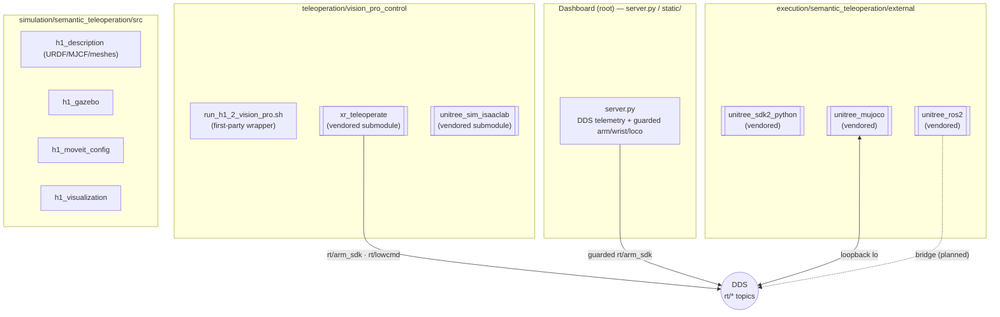
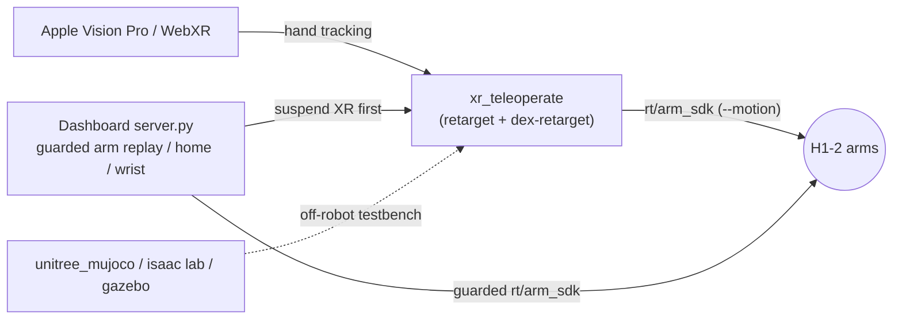

# 21 - Semantic Teleoperation Pipeline

> [!abstract] Goal
> `humanoid-robot-gui` is a **monorepo**, not just the dashboard. Alongside
> `server.py` and `static/` it carries three sibling robotics workspaces that
> were consolidated from separate local checkouts: an **XR/Vision Pro
> teleoperation** leg, an **execution** leg (Unitree SDK / ROS 2 / MuJoCo), and
> a **simulation** leg (H1 Gazebo / MoveIt / URDF). This note maps those
> subsystems, marks what is **first-party** vs a **vendored external**, and
> explains — conceptually — how they relate to the dashboard and the deployed
> XR teleop service ([[11 - Teleoperation (Vision Pro & XR)]]).

Sources: `docs/workspace_inventory.md`; `README.md` repo-layout tree (§80–86);
`teleoperation/vision_pro_control/` (README + `.gitmodules` + `docs/control_path.md`);
`simulation/semantic_teleoperation/docs/{gazebo,unitree_mujoco,unitree_ros2}.md`;
and directory listings of `teleoperation/`, `execution/semantic_teleoperation/`,
`simulation/semantic_teleoperation/`.

> [!warning] "Pipeline" is a conceptual framing, not a wired end-to-end system
> The repo docs do **not** define a single automated "semantic teleoperation
> pipeline" that runs from input to hardware. "semantic teleoperation" is the
> **name of the source workspace** (`/home/ch/Workspace/semantic-teleoperation`,
> per `docs/workspace_inventory.md`) that was folded into this monorepo. The
> subsystems below are **independent developer stacks** — the dashboard does not
> orchestrate them. Where this note describes them as one flow, that flow is
> **inferred from directory structure and per-stack docs**, not from integration
> code. Treat cross-stack claims accordingly.

## The monorepo subsystems

Per `docs/workspace_inventory.md` and the `README.md` layout tree:

| Path | Role | Origin (per inventory) |
| --- | --- | --- |
| `server.py`, `static/`, `deployment/` | The telemetry + XR operator **dashboard** (the main product) | root of this repo |
| `teleoperation/vision_pro_control` | XR/Vision Pro **input + retargeting** leg | former `h1_2_vision_pro_control` |
| `execution/semantic_teleoperation` | **Execution-side** Unitree externals (SDK2 / ROS 2 / MuJoCo) | former `semantic-teleoperation/execution` |
| `simulation/semantic_teleoperation` | **Simulation** leg (H1 Gazebo / MoveIt / viz / URDF) | former `semantic-teleoperation/simulation` |
| `robot_models/unitree_h1_2` | H1-2 model assets | former `unitree_ros_tmp` checkout |
| `vendor/unitree_sdk2_python` | Unitree SDK2 Python source + examples | former `unitree_sdk2_python` |
| `tools/rh56` | RH56 hand port-probe / finger utilities | former `rh56_tools` |



## First-party vs vendored (verified by directory listing)

> [!note] How to tell them apart in this repo
> First-party = the thin local wrappers, launch scripts, config and docs the team
> wrote. Vendored externals = upstream Unitree (or third-party) code kept under an
> `external/` directory, several as git **submodules**. Do not treat vendored
> READMEs as authoritative for *this* project's behavior.

| Subsystem | First-party (this team) | Vendored external |
| --- | --- | --- |
| `teleoperation/vision_pro_control` | `README.md`, `scripts/run_h1_2_{vision_pro,sim,xr_sim}.sh`, `docs/control_path.md`, `.gitmodules` | `external/xr_teleoperate` (submodule → `unitreerobotics/xr_teleoperate`), `external/unitree_sim_isaaclab` (submodule → `unitreerobotics/unitree_sim_isaaclab`) |
| `execution/semantic_teleoperation` | *(none — only an `external/` tree)* | `external/unitree_mujoco`, `external/unitree_ros2`, `external/unitree_sdk2_python` (all vendored; nested `.git` stripped per inventory) |
| `simulation/semantic_teleoperation` | `src/{h1_description,h1_gazebo,h1_moveit_config,h1_visualization}`, `scripts/*`, `docs/*`, `dependencies/*.repos` | pulls upstream via `dependencies/unitree_{mujoco,ros2}.repos` at fetch time |

The two `vision_pro_control` submodules are declared in
`teleoperation/vision_pro_control/.gitmodules`
(`github.com/unitreerobotics/xr_teleoperate` and `.../unitree_sim_isaaclab`).
The `execution/` externals had their nested `.git`, `__pycache__`, `.venv`, and
colcon `build/install/log` outputs intentionally excluded on consolidation
(`docs/workspace_inventory.md` "Excluded Generated Artifacts").

## Leg 1 — Teleoperation input + retargeting (`teleoperation/vision_pro_control`)

This is the same stack documented in detail in
[[11 - Teleoperation (Vision Pro & XR)]]; here it is placed in the wider pipeline.
The launch wrapper runs upstream `teleop_hand_and_arm.py` (per the
`vision_pro_control/README.md` and `docs/control_path.md`):

```bash
python teleop_hand_and_arm.py --input-mode hand --display-mode immersive \
  --arm H1_2 --img-server-ip 192.168.123.164 --network-interface eth0 --motion
```

Inside the vendored `xr_teleoperate/teleop/` tree (verified by listing), the
retargeting-relevant components are:

| Component (vendored) | What it is for |
| --- | --- |
| `robot_control/robot_arm_ik.py` | Arm IK — maps tracked hand/wrist pose to H1-2 arm joint angles |
| `robot_control/robot_arm.py` | `H1_2_ArmController` — commands the 14 arm joints |
| `robot_control/dex-retargeting/` | **Dexterous hand retargeting** library — human finger pose → robot hand joints |
| `robot_control/hand_retargeting.py`, `robot_hand_{inspire,unitree,brainco}.py` | Hand drivers / retarget glue for the different end-effectors |
| `teleop/televuer/` | The **Vuer/WebXR** bridge — serves the headset page, streams tracked poses in |
| `teleop/teleimager/` | **TeleImager** camera image server/client for the headset video feed (12 - Camera & Video Streaming) |

> [!note] Where retargeting happens
> Retargeting (tracked human pose → robot joints, incl. `dex-retargeting` for
> fingers) lives entirely in the **vendored** `xr_teleoperate` code, not in
> `server.py`. The dashboard's own IK is a separate, preview-only path in the 3D
> viewer (13 - Telemetry Recording & Pose Editor). Both ultimately target the
> same H1-2 arm joints and the same `rt/arm_sdk` topic — which is exactly why
> only one may own the arm at a time ([[16 - Arm Control & Command Surfaces]]).

The H1-2 arm joint order and topic contract are documented in
`teleoperation/vision_pro_control/docs/control_path.md`: right arm joints `20–26`
(shoulder pitch/roll/yaw, elbow pitch/roll, wrist pitch/yaw), `--motion` →
`rt/arm_sdk` with `q = 1.0` written to reserved weight slot `27`, `--no-motion` →
`rt/lowcmd`, and `rt/lowstate` for feedback. **Right wrist yaw = index 26**, the
same index the dashboard's guarded wrist path uses.

`external/unitree_sim_isaaclab` is Unitree's **Isaac Lab / Isaac Sim** simulator
submodule, offered as the simulation target for XR teleop
(`run_h1_2_sim.sh` + `run_h1_2_xr_sim.sh`).

> [!warning] Isaac Lab is not runnable on the current host
> `vision_pro_control/README.md` states the full Isaac Lab sim needs Isaac Sim /
> Isaac Lab and that the current host exposes neither `conda` nor `nvidia-smi`,
> so it "cannot be launched yet from the default shell." Contents of the
> `unitree_sim_isaaclab` submodule (`sim_main.py`, `tasks/{g1,h1-2}_tasks`,
> `action_provider`, `dds/`, etc.) are **vendored upstream** and were not audited
> for this note.

## Leg 2 — Execution-side externals (`execution/semantic_teleoperation/external`)

Purely vendored — three Unitree stacks that make up the low-level command/state
path. Summaries from `simulation/semantic_teleoperation/docs/*` and the SDK
listing:

| External | Purpose | Notes |
| --- | --- | --- |
| `unitree_sdk2_python` | Python bindings for Unitree SDK2 DDS messages (also mirrored at repo-root `vendor/unitree_sdk2_python`) | vendored; used by the MuJoCo bridge scripts |
| `unitree_ros2` | Unitree ROS 2 message packages + examples (`unitree_hg`, `unitree_api`, `read_low_state_hg`, `low_level_ctrl_hg`) | vendored; "external dependency, not vendored source" upstream, fetched via `dependencies/unitree_ros2.repos` |
| `unitree_mujoco` | MuJoCo simulator speaking the same SDK2 DDS messages; official H1 MJCF at `unitree_robots/h1`; loopback DDS on interface `lo`, domain `1` | vendored; the sim-to-real DDS testbed |

> [!warning] Execution leg is a low-level dev/testbench, not a walking controller
> `docs/unitree_mujoco.md` is explicit: the MuJoCo simulator "mainly supports
> **low-level** development" and does **not** provide Unitree's proprietary
> high-level walking controller. The bundled demos (stand+handshake, two-step
> walk, jump) are "**simulation-only** SDK2 low-level command demos … not
> certified real-robot behavior" and must not go to hardware without limits and
> an e-stop path. See 03 - Safety Interlocks.

First-party glue for this leg lives in **`simulation/.../scripts/`** (below), not
in `execution/` — e.g. `h1_mujoco_*.py`, `h1_loco_set_velocity_walk.py`, the
`loco` RPC shim `h1_mujoco_loco_shim.py`, and a guarded real-robot demo
`h1_real_handshake_guarded.py`.

## Leg 3 — Simulation stack (`simulation/semantic_teleoperation`)

First-party ROS 2 / simulation packages under `src/`, plus fetch/build/run
scripts. Summaries per the three sim docs:

| Package (`src/`) | Purpose |
| --- | --- |
| `h1_description` | H1 model assets — `urdf/`, `mjcf/`, `meshes/` (the shared robot description) |
| `h1_gazebo` | Launches the H1 URDF in **Gazebo Classic** via ROS 2 Humble; `fixed_base`/`paused`/`enable_walk` args. Visualization/physics spawn + a scripted alternating-gait animation — **not** Unitree's real walking controller (`docs/gazebo.md`) |
| `h1_moveit_config` | MoveIt configuration for motion planning against the H1 model |
| `h1_visualization` | RViz visualization launch + config |

Three sim docs describe how these tie to the execution externals:

- `docs/gazebo.md` — quick ROS/Gazebo **visualization** spawn; fixed-base by
  default, optional scripted walk. Explicitly "not a 1:1 replica of Unitree's
  real onboard walking controller."
- `docs/unitree_mujoco.md` — the more **sim-to-real** path: MuJoCo speaks the same
  Unitree DDS messages as `unitree_ros2` / SDK2, so it is the preferred testbench
  for the DDS command path (`rt/lowcmd` / `rt/lowstate`).
- `docs/unitree_ros2.md` — the **ROS 2 ↔ real-robot** bridge: `unitree_hg` /
  `unitree_api` message packages and examples for reading state and low-level
  control over DDS.

> [!warning] Scripts reference the old absolute workspace path
> The sim scripts and docs still `cd "/home/ch/Workspace/semantic-teleoperation"`
> and pull externals into an `external/` dir that is **git-ignored** (per the
> docs). Those paths reflect the pre-consolidation checkout, not the monorepo
> layout — verify before running. This is stated in `docs/unitree_{mujoco,ros2}.md`.

## How it relates to the dashboard and XR teleop



- **Shared control surface, mutual exclusion.** XR teleop and the dashboard both
  publish to `rt/arm_sdk`. The dashboard treats XR as a competing owner: every
  guarded arm entry point calls `_suspend_xr_motion_publishers()` **first**, which
  stops/kills `xr-teleop.service` before the dashboard touches the arm. See
  [[11 - Teleoperation (Vision Pro & XR)]] and 03 - Safety Interlocks.
- **The dashboard does not run the semantic/execution legs.** `server.py` does not
  import or launch `execution/` or `simulation/` code. Those are standalone dev
  workspaces for off-robot experimentation and low-level SDK/ROS 2 development.
- **Common substrate.** All legs converge on the same H1-2 model (`h1_description`
  / `robot_models/unitree_h1_2` / `static/models/h1_2_description`) and the same
  Unitree DDS topic vocabulary (`rt/arm_sdk`, `rt/lowcmd`, `rt/lowstate`,
  `rt/inspire/state`) — which is what makes retargeting outputs, sim state, and
  dashboard telemetry describe the same robot.
- **Simulation as the safe rehearsal path.** MuJoCo (DDS-accurate) and Isaac Lab
  are the intended places to validate motion before it reaches hardware, matching
  the dashboard's own "sim/validate before raw replay on the real robot" posture
  (13 - Telemetry Recording & Pose Editor).

> [!warning] Deployment scope
> Only the **dashboard** and the **XR teleop** service are deployed as robot
> systemd units (`deployment/systemd/`, 22 - Deployment & Runtime Services).
> The `execution/` and `simulation/` legs are **not** installed as robot services
> — they are developer tooling that runs off-robot (or manually). No evidence in
> `deployment/` was found of a semantic/MuJoCo/Gazebo runtime service.

## Related

[[11 - Teleoperation (Vision Pro & XR)]] · [[16 - Arm Control & Command Surfaces]]
