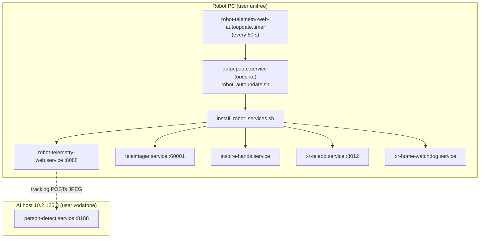
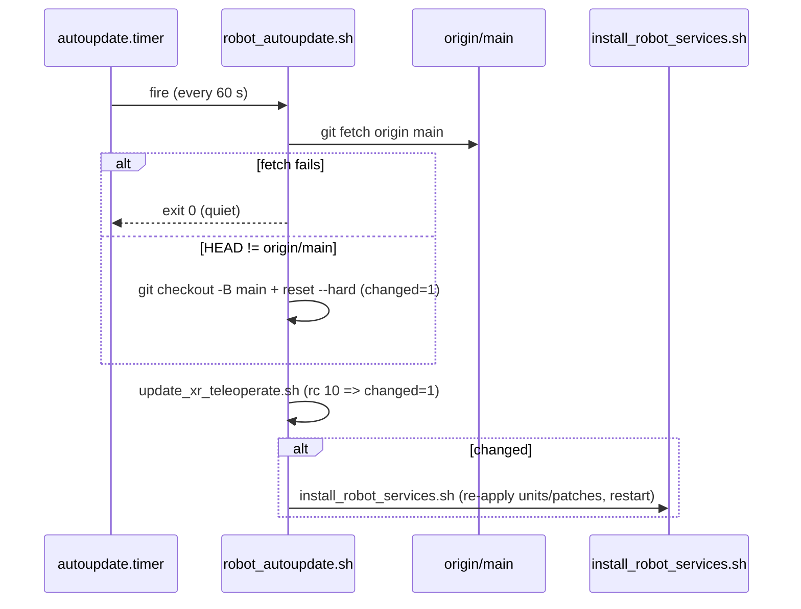

# 22 - Deployment & Runtime Services

How the dashboard and its sibling services actually run on the robot PC, how a
`git push` to `main` reaches the robot, and the helper scripts that keep it all
alive. See 08 - Development Workflow for the git side and
02 - Network & Hosts for the host/port map.

## Overview

## Robot systemd units (verified filenames)

All are **user-level** units under the `unitree` user, installed from
`deployment/systemd/` into `~/.config/systemd/user/` by
`deployment/install_robot_services.sh`. Filenames below are the actual files in
the repo — not guesses.

| Unit file | Type | Role | Key detail |
| --- | --- | --- | --- |
| `robot-telemetry-web.service` | simple | Dashboard, HTTP API, DDS telemetry, guarded command endpoints | Runs `server.py --host 0.0.0.0 --port 8088 --robot-host 192.168.123.164 --camera-source eth0 --camera-backend teleimager` |
| `robot-telemetry-web-autoupdate.service` | oneshot | Runs `deployment/robot_autoupdate.sh` | Triggered by the timer, `After=network-online.target` |
| `robot-telemetry-web-autoupdate.timer` | timer | Periodic auto-deploy | `OnBootSec=45s`, `OnUnitActiveSec=60s` |
| `teleimager.service` | simple | Unitree TeleImager image server (WebRTC + ZMQ) | `:60001`, `python -m teleimager.image_server` |
| `inspire-hands.service` | simple | Inspire DFX/RH56 hand bridge | DDS hand topics, serial `by-path` devices |
| `xr-teleop.service` | simple | Vision Pro / XR Vuer teleop server | `:8012`, `XR_TELEOP_VUER_PORT=8012` |
| `xr-home-watchdog.service` | simple | Homes robot when an active XR session drops | Runs `deployment/xr_home_watchdog.py --xr-port 8012 --lost-seconds 1` |

> [!note] Micromamba runtime
> Services run the interpreter from the `tv` micromamba env:
> `/home/unitree/.micromamba/envs/tv/bin/python`. `MAMBA_ROOT_PREFIX=/home/unitree/.micromamba`.

### eth0-ready gating (cold-boot robustness)

Both `robot-telemetry-web.service` and `teleimager.service` have an
`ExecStartPre` that waits up to 60 s for `eth0` to come up with a
`192.168.123.x` address before starting, so DDS binds to the correct interface
(a not-yet-ready `eth0` at boot otherwise leaves telemetry "disconnected" until
a manual restart). See the Wi-Fi vs Ethernet warning in
02 - Network & Hosts.

`teleimager.service` adds two more `ExecStartPre` steps:

- `deployment/wait_for_videohub.py` — blocks until `VideoClient.GetImageSample`
  actually returns a frame (the MCU's video service comes up later than user
  services on a cold boot; the image server only initialises the camera once).
- `deployment/patch_teleimager_config.py` — re-applies
  `head_camera.enable_zmq: true` on **every** start, because the `~/teleimager`
  checkout is reset by update flows and would otherwise revert (see
  12 - Camera & Video Streaming).

### Service dependencies

- `xr-teleop.service`: `After=/Wants= teleimager.service inspire-hands.service`.
- The watchdog and XR teleop units are the pair suspended before dashboard
  motion: `XR_MOTION_SERVICES = ("xr-home-watchdog.service", "xr-teleop.service")`
  — see 03 - Safety Interlocks and 11 - Teleoperation (Vision Pro & XR).

### The XR home watchdog

`deployment/xr_home_watchdog.py` polls established TCP peers on the XR port
(`ss -Htan`) plus the XR IPC state (`START` flag). When an armed, active session
is lost it first POSTs `stop_move` to `/api/loco/command`, then after
`--lost-seconds` POSTs `/api/robot/home` — both against the local dashboard on
`127.0.0.1:8088`. See 15 - Locomotion Control and
04 - HTTP API Reference.

## Auto-deploy flow (push to main → ~60 s → restart)

The core deployment mechanism. `deployment/robot_autoupdate.sh` (run by the
oneshot service every 60 s):

Key points, verified against the scripts:

1. `git fetch origin main`; exits 0 quietly on failure (never wedges).
2. If `HEAD != origin/main`: `git checkout -B main origin/main` +
   `git reset --hard origin/main`, marks `changed`.
3. `deployment/update_xr_teleoperate.sh` fetches the
   `unitreerobotics/xr_teleoperate` checkout; a real update exits **rc 10**,
   which also marks `changed` (rc 0 = no change, any other rc = abort).
4. If changed, runs `install_robot_services.sh`.

> [!warning] Consequence
> Anything on `main` reaches the robot within ~60 s and restarts services. Ship
> risky features **dark** behind default-off flags (e.g. `MCP_ENABLED=0`, the
> planned `TRACKING_ENABLED=0`) — see 08 - Development Workflow,
> 05 - Chat & MCP Tools, 06 - Person Tracking (CV Feature).

## The installer: `install_robot_services.sh`

Verified sequence:

1. Runs `update_xr_teleoperate.sh` (tolerates rc 0 and 10; aborts otherwise).
2. Copies all seven unit files from `deployment/systemd/` into
   `~/.config/systemd/user/`.
3. Applies XR-checkout patch scripts (see below).
4. Runs `deployment/ensure_xr_python_requirements.sh`.
5. `loginctl enable-linger` for the user (so user services survive logout).
6. `systemctl --user daemon-reload`, then `enable --now` and `restart` for the
   core units, then prints their status.

### Patch scripts applied by the installer

These re-apply local modifications to the vendored `xr_teleoperate` checkout
(which update flows reset). Invoked in this order by `install_robot_services.sh`:

| Script | Notes |
| --- | --- |
| `patch_xr_teleop_launcher.sh` | XR teleop launcher — see 11 - Teleoperation (Vision Pro & XR) |
| `patch_xr_camera_config.py` | XR camera config |
| `patch_xr_image_server.py` | XR image server |
| `patch_xr_dex_retargeting.py` | Dex-retargeting for the hands |
| `patch_xr_inspire_direct_curl.py` | Inspire direct-curl hand control |
| `patch_xr_hand_input_swap.py` | Hand input swap |
| `patch_xr_head_tilt_loco.py` | Head-tilt-driven locomotion |
| `patch_xr_root_children_visual.py` | Vuer root children visuals |
| `patch_vuer_loco_pointer_events.py` | Vuer loco pointer events |

> [!note] Patch files present but NOT called by the installer
> `patch_teleimager_config.py` is instead an `ExecStartPre` of
> `teleimager.service`. `patch_xr_image_client.py` and `patch_xr_televuer.py`
> exist in `deployment/` but are not referenced by `install_robot_services.sh` —
> purpose/usage unverified (likely applied manually or by another flow).

## AI-host service: `person-detect.service`

Lives in `deployment/ai_host/` and runs on the AI host (`10.2.125.3`) under the
**`vodafone`** user (not `unitree`):

- `WorkingDirectory=/home/vodafone/person-tracking`,
  `ExecStart=.../venv/bin/python .../detect_service.py`, `Restart=always`.
- Serves YOLOv8n person detection on `:8188` (`POST /detect`, `GET /health`).
- Install/smoke-test steps are in `deployment/ai_host/README.md`.

The robot's tracking loop reaches it at `http://10.2.125.3:8188/detect`
(`TRACKING_DETECT_URL`). Full contract in [[07 - Detection Service (YOLO)]] and
06 - Person Tracking (CV Feature).

## Local dev helpers: `run_servers.py` / `kill_servers.py`

`run_servers.py` — "kill stale servers, then start a fresh one":

- `--mode auto` picks **systemd** for the `unitree` user (when `systemctl --user`
  is available) and **foreground** everywhere else.
- Builds the `server.py` command (host/port/domain/robot-host/camera args),
  optionally via `micromamba run -n tv`; in systemd mode it writes its own
  `robot-telemetry-web.service`, `daemon-reload`, `enable --now`.
- Typical local run:
  `python3 run_servers.py --mode foreground --host 0.0.0.0 --port 8088 --no-kill-first`.

`kill_servers.py` — stops dashboard servers:

- Stops/kills the user units `robot-telemetry-web.service` and
  `robot-telemetry-web-main.service`.
- Scans `/proc` for processes matching markers like `server.py --host` and
  `python -m http.server`; `SIGTERM`, waits `--grace`, then `SIGKILL`.
- `--include-all-python` is broader ("python" + "server") — robot dashboard host
  only.

See the Local development section of 08 - Development Workflow.

## macOS LaunchAgents (showcase tunnel)

`deployment/launchagents/` holds **versioned backups** of the macOS
`~/Library/LaunchAgents/` plists used for the local (Mac) dashboard exposure —
e.g. `com.vodafone.robot-dashboard-cloudflared.plist`,
`...-readonly-proxy.plist`, `...-tunnel-url.plist`, `...robot-dashboard.plist`.
Per its README these are a reference/backup copy; the live files stay in
`~/Library/LaunchAgents/`. (Exact behaviour of each plist not detailed here.)

## Logs

`/home/unitree/logs/` — dashboard: `robot_telemetry_web.log`; watchdog:
`xr_home_watchdog.log`.

## Related

[[07 - Detection Service (YOLO)]]
