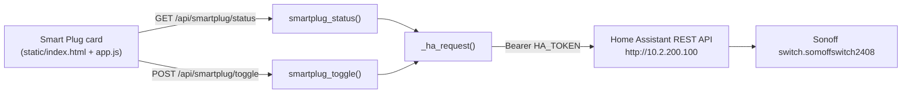

# 23 - Smart Plug & Home Assistant

> [!abstract] Goal
> A tiny **showcase** integration: a Robot-Status mini-panel that toggles a
> single Sonoff smart plug (`SomoffSwitch2408`) through the lab **Home
> Assistant** instance. The server proxies both calls so the **HA long-lived
> access token stays out of the browser**. It controls a demo wall plug — it
> commands **no robot motion** and carries **no safety interlocks**.

> [!warning] Feature was removed from the current codebase
> The Smart Plug feature was added in commit `0ea306a` (2026-07-15) and
> **removed** in commit `b01b0a5` (2026-07-23, "Replace toolbar text buttons
> with icons; remove smart-plug power toggle") — the `/api/smartplug` endpoints,
> the HA proxy, the UI card, the CSS and `tests/test_smartplug.py` all went with
> it. This note documents the implementation **as it existed** (grounded in the
> `0ea306a` diff of `server.py`, `static/app.js`, `static/index.html`,
> `tests/test_smartplug.py`, README) for reference and for anyone reinstating
> it. Do not expect these routes to answer on the current build.

Sources (commit `0ea306a`): `server.py` (`HA_BASE_URL`, `HA_TOKEN`,
`HA_SWITCH_ENTITY`, `HA_TIMEOUT_SECONDS`, `_ha_request`, `smartplug_snapshot`,
`smartplug_status`, `smartplug_toggle`), `static/app.js`
(`loadSmartplugStatus`, `sendSmartplugToggle`, `renderSmartplugStatus`),
`static/index.html` (Smart Plug mini-panel), `tests/test_smartplug.py`,
README "Smart Plug (Home Assistant)".

## How it worked

The browser never spoke to Home Assistant directly — it only hit the two local
endpoints, and the server added the `Authorization: Bearer <HA_TOKEN>` header
when calling HA. This is the same "token stays server-side" pattern the LLM
chat proxy uses ([[05 - Chat & MCP Tools]]).

## Configuration (service environment)

| Variable | Default | Meaning |
| --- | --- | --- |
| `HA_TOKEN` | *(empty)* | HA long-lived access token. **Empty = feature disabled**: the card reports "Not set up" and the toggle stays disabled. |
| `HA_BASE_URL` | `http://10.2.200.100` | Home Assistant base URL (trailing slash stripped). |
| `HA_SWITCH_ENTITY` | `switch.somoffswitch2408` | Entity id of the plug. |
| `HA_TIMEOUT_SECONDS` | `6` | Per-request timeout to HA. |

The token was set on the robot in the `robot-telemetry-web.service` environment
(README documented a systemd `Environment=HA_TOKEN=…` override, then
`daemon-reload` + `restart`) so it lived only on the robot PC, never in the
repo or the page. See [[22 - Deployment & Runtime Services]] and
[[02 - Network & Hosts]] for host `10.2.200.100`.

## The endpoints

| Path | Method | Behavior |
| --- | --- | --- |
| `/api/smartplug/status` | GET | `smartplug_status()` — current plug state |
| `/api/smartplug/toggle` | POST | `smartplug_toggle()` — flip the plug |

**`smartplug_status()`** — with no `HA_TOKEN` returns **200** with
`{enabled: false, state: "unavailable", error: "Smart plug is not configured
(set HA_TOKEN)."}`. With a token it GETs `/api/states/{HA_SWITCH_ENTITY}` on HA
and shapes the reply (`smartplug_snapshot`) into
`{ok, enabled: true, entity, state, friendly_name}` — `state` is HA's raw
`state` string (`on` / `off` / `unavailable`) and `friendly_name` comes from
the entity attributes.

**`smartplug_toggle()`** — with no token returns **503**
`Smart plug is not configured`. With a token it POSTs
`/api/services/switch/toggle` with `{"entity_id": HA_SWITCH_ENTITY}`. HA answers
with the list of changed states; if our entity is in that list its new state is
returned directly, otherwise the code **re-queries** `smartplug_status()` to
report the settled state.

**`_ha_request(path, payload=None)`** is the shared client: GET when `payload`
is None, POST otherwise, always with the bearer header. It **never raises** on
network errors — mirroring `call_llm()` it maps them to JSON error payloads:

| Failure | HTTP returned |
| --- | --- |
| HA HTTP error | 502 (`Home Assistant returned HTTP <code>: <detail>`) |
| Cannot reach HA (`URLError`) | 503 |
| Timeout (`socket.timeout`) | 504 |
| Any other exception | 502 |

## The dashboard card

`static/index.html` placed a "Smart Plug" mini-panel in the Robot-Status grid:
a `pill` state badge plus a single toggle button. `static/app.js`
(`loadSmartplugStatus`) polled `GET /api/smartplug/status` every 5 s and
`renderSmartplugStatus` set the label — **On** / **Off** / raw HA state, or
**"Not set up"** when disabled — enabling the button only when the plug reports
a known `on`/`off` state. Clicking called `sendSmartplugToggle` →
`POST /api/smartplug/toggle`, showing "Switching…" until the new state came
back (re-polling on error).

`tests/test_smartplug.py` covered: status without token = not-configured;
toggle without token = 503; status parsing an HA state object (asserting the
GET, the `Bearer token` header and the `/api/states/…` URL); toggle returning
the changed state from the service reply; and toggle **re-querying** when the
entity is absent from the service reply.

## Safety posture

> [!important] Demo device, not a robot control
> This toggles a **wall plug on the lab Home Assistant** — a showcase of the
> dashboard proxying an external IoT service. It never commands the H1-2, never
> touches DDS / arm_sdk / LocoClient, and is not part of any safety interlock.
> It therefore has **no risk-acknowledgement gate** (unlike wrist, loco and
> tracking), because there is no robot motion to gate. The only real guardrail
> is that the HA token is held server-side and the feature is inert until a
> token is provisioned. For the genuinely dangerous surfaces see
> [[03 - Safety Interlocks]], [[15 - Locomotion Control]] and
> [[16 - Arm Control & Command Surfaces]].

## Related

[[02 - Network & Hosts]] · [[22 - Deployment & Runtime Services]] · [[04 - HTTP API Reference]] · [[05 - Chat & MCP Tools]] · [[03 - Safety Interlocks]] · [[25 - Known Issues & Optimization Audit]] · [[09 - Glossary]]
