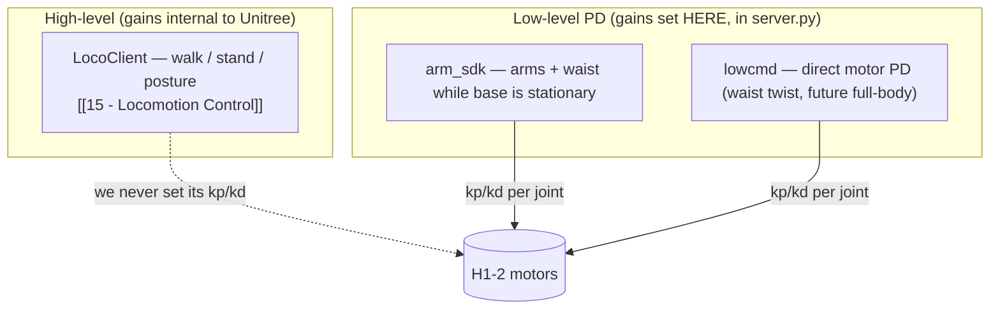

# 24 - Control Gains, PID & Shared Mechanisms

> [!abstract] Goal
> Explain the robot's control gains in one place, because they are **cross-cutting**:
> the same low-level PD gain tables and the same closed-loop arm-replay PID are
> reused by every feature that moves the arms — the High Level Controller
> (13 - Telemetry Recording & Pose Editor / 14 - Recording Replay & Digital Twin),
> the LLM agent (20 - LLM Arm Pose Proposals & Mimic),
> and Sentry Mode person-following. A gain change
> here affects all three.

Sources: `server.py` (`ARM_SDK_KP`/`ARM_SDK_KD`, `ARM_SDK_GAIN_BY_INDEX`,
`LOWCMD_BASE_GAINS`, `GAIN_NOMINALS`, `ARM_REPLAY_PID_GAINS`, `WAIST_LOWCMD_KP/KD`,
`ARM_REPLAY_*` scales, `_arm_replay_pid_gain`, `_auto_wrist_gains`,
`_build_arm_sdk_cmd`, `_build_lowcmd_wrist_cmd`, `execute_arm_sdk_replay`),
`docs/gain_selection_research.md`.

## Two control layers

| Layer | Path | Who owns the gains |
| --- | --- | --- |
| **High-level** | `LocoClient` (15 - Locomotion Control) | Unitree's on-board controller — the dashboard sends *commands* (velocity, posture), **not** gains |
| **Low-level PD** | `arm_sdk` (arms+waist, base stationary) | **`server.py` sets `kp`/`kd` per joint** |
| **Low-level PD** | `lowcmd` (direct motor) | `server.py` sets `kp`/`kd`; used for a waist twist today, reserved for future full-body playback |

> [!important] The gains in this note are the **low-level PD** gains only
> Locomotion gaits ride Unitree's high-level controller and are *not* tuned here.
> Everything below is about the `arm_sdk` / `lowcmd` PD loops.

## The gain tables (verbatim from `server.py`)

### `arm_sdk` base gains — the arm/waist hold table

`ARM_SDK_KP` / `ARM_SDK_KD`, indexed over `ARM_SDK_JOINTS`
(`[13,14,15,16,17,18,19, 20,21,22,23,24,25,26, 12]` — left arm, right arm, waist):

| Joint group | Kp | Kd |
| --- | ---: | ---: |
| Shoulder pitch/roll | 120 | 2.0 |
| Shoulder yaw | 80 | 1.5 |
| Elbow | 50 | 1.0 |
| Wrist (yaw/roll/pitch) | 50 | 1.0 |
| Waist yaw (idx 12) | 200 | 2.0 |

Exposed as `ARM_SDK_GAIN_BY_INDEX` (motor index → `(kp, kd)`) and reused when
driving the arms via `lowcmd` during a torso twist so they still hold against
gravity. Waist under `lowcmd` uses `WAIST_LOWCMD_KP = 200.0`, `WAIST_LOWCMD_KD = 5.0`.

### `lowcmd` conservative base — future full-body playback

`LOWCMD_BASE_GAINS` (starting points, **not** robot-tuned):

| Group | Kp | Kd | | Group | Kp | Kd |
| --- | ---: | ---: | --- | --- | ---: | ---: |
| hip | 40 | 1.0 | | shoulder | 25 | 0.8 |
| knee | 45 | 1.1 | | elbow | 20 | 0.7 |
| ankle | 30 | 0.8 | | wrist | 12 | 0.5 |
| waist | 35 | 1.0 | | | | |

### Outer-loop PID — closed-loop arm replay

`ARM_REPLAY_PID_GAINS` (`kp, ki, kd`) for the *outer* correction loop that sits
on top of the motor PD (note the **integral** term — this is a true PID):

| Group | Kp | Ki | Kd |
| --- | ---: | ---: | ---: |
| shoulder | 0.28 | 0.035 | 0.018 |
| elbow | 0.24 | 0.03 | 0.014 |
| wrist | 0.18 | 0.02 | 0.012 |
| waist | 0.12 | 0.01 | 0.01 |

## The closed-loop arm replay (the shared motion primitive)

`execute_arm_sdk_replay` is the **one guarded path** that actually moves the arms
to a target pose. Every arm feature routes through it (see the sharing table
below). Its control stack, from the gains above:

- **Inner motor PD** — `arm_sdk` per-joint `kp`/`kd`, scaled: `ARM_REPLAY_INNER_KP_SCALE = 0.35`,
  `ARM_REPLAY_INNER_KD_SCALE = 1.2` in closed-loop mode (direct/approach have their
  own scales; `_arm_replay_pid_gain` applies them).
- **Outer PID** — `ARM_REPLAY_PID_GAINS` drives the setpoint correction toward the
  recorded/target angle.
- **Gravity feed-forward + adaptive learn** — feeds measured holding torque forward
  (`ARM_REPLAY_GRAVITY_*`: hold/move blend by joint stationarity, low-pass
  `TAU_FILTER_SECONDS = 0.4`, bounded adaptive `LEARN_GAIN = 22.0` /
  `LEARN_LIMIT = 4.0`, per-joint `GRAVITY_TAU_LIMITS` shoulder 15 / elbow 10 / wrist 4 / waist 6 Nm).
- **Hold phase** — stiffens position (`HOLD_KP_SCALE = 0.55`) but deliberately keeps
  `kd` near nominal (`HOLD_KD_SCALE = 1.2`) and runs faster (`HOLD_HZ = 120`).
- **Convergence** — the only success exit: joint inside band + nearly stationary
  (`CONVERGE_VELOCITY_RAD_S = 0.05`) **and** a Cartesian silhouette tolerance
  (`CARTESIAN_TOLERANCE_M = 0.006`, lever-arm weighted). Stall escalation ramps
  authority (bounded) instead of stalling; an absolute ceiling (`90 s`) forces a
  **flagged safe-hold** that reports `converged=false` rather than claiming success.
- **Response slider** — `ARM_REPLAY_RESPONSE_*` scales the PID aggressiveness
  (legacy top at 2.5 = the UI 50% mark; overdrive to 5.0), capped so effective
  speed stays within the validated velocity envelope (see 03 - Safety Interlocks).

> [!warning] Gravity feed-forward on contact
> The feed-forward is built from *measured* torque, which already contains the
> PD reaction — safe for free-space holding, but **unsafe on hard contact**
> (a contact torque spike feeds forward as a push). Model-based gravity +
> collision detection is the recommended hardware-validated follow-up. See
> 25 - Known Issues & Optimization Audit.

## Why this is cross-cutting — one primitive, three callers

> [!important] The example in one line
> The arm-replay PID + `arm_sdk` gain tables are used by the **High Level
> Controller**, the **LLM agent**, and **Sentry Mode** alike — they are three
> front-ends onto the same guarded motion primitive.

| Caller | How it reaches the shared gains |
| --- | --- |
| **High Level Controller** (13 - Telemetry Recording & Pose Editor / 14 - Recording Replay & Digital Twin) | Dashboard "Move" / replay planning → `execute_arm_sdk_replay` with the arm-replay PID + `arm_sdk` gains; `dry_run` reports the per-joint `kp`/`kd` plan |
| **LLM agent** (05 - Chat & MCP Tools / 20 - LLM Arm Pose Proposals & Mimic) | `move` tool and approved `propose_arm_pose` poses execute through the **same** `execute_arm_sdk_replay` — the LLM never sets gains, it only chooses the target pose |
| **Sentry Mode** (19 - Sentry Mode & Head-Lock / 06 - Person Tracking (CV Feature)) | Person-following drives the arm toward the target and the **wrist fine-aim** uses `_auto_wrist_gains` on the same `arm_sdk` / `lowcmd` wrist PD (`_build_arm_sdk_cmd` / `_build_lowcmd_wrist_cmd`) |

Because they share one path, all three inherit the **same guards** — arm-scope
only, non-finite rejection, velocity/delta gates, XR-publisher suspend, and the
convergence/safe-hold discipline. See 03 - Safety Interlocks and
16 - Arm Control & Command Surfaces.

## Gain-selection policy (future `lowcmd` trajectory execution)

`docs/gain_selection_research.md` defines the conservative policy for the
not-yet-enabled full-body `lowcmd` playback (14 - Recording Replay & Digital Twin):

1. Pick the command path: `arm_sdk` when the base is stationary, `lowcmd` when it moves.
2. Pick a base gain table by path + joint group (`LOWCMD_BASE_GAINS`).
3. Scale gains only within conservative bounds (`0.6×…1.2×` base), using an
   **offline demand score** (`max(step, velocity, accel, range)` vs `GAIN_NOMINALS`)
   and an **online tracking score** (position error, overshoot, oscillation,
   `tau`/current/temperature saturation).
4. `kp = base_kp · scale`, `kd = base_kd · √scale`; reduce `kp` on oscillation.
5. **Never chase a bad trajectory with stronger gains — retime/slow it.** Abort on
   actuator saturation or stale telemetry.

> [!note] Design principle
> "The robot should never *argue harder* with the trajectory when the safer
> answer is to move slower." Gains are bounded; safety comes from slowing,
> rejecting, and aborting — not from stiffness.

